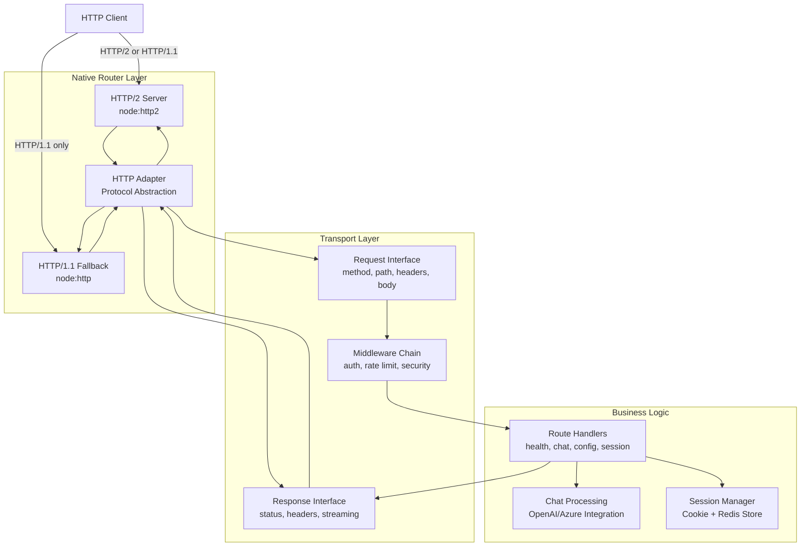

# Design Document: Express to Native Routing Migration

## Overview

This design specifies the migration of the ChatGPT Web API service from Express.js to a native Node.js routing implementation using the `node:http2` module. The migration creates a framework-agnostic Transport Layer abstraction that decouples business logic from HTTP framework specifics, enabling long-term maintainability and portability.

### Goals

- Remove all Express runtime dependencies (express, express-session, express-rate-limit, helmet, connect-redis)
- Implement native HTTP/2 routing using Node.js 24 built-in modules
- Preserve 100% API compatibility with existing endpoints and behavior
- Maintain all security policies (authentication, rate limiting, CSP headers, session management)
- Require Node.js 24 LTS and MAY leverage its features where beneficial

### Non-Goals

- Changing API endpoint paths or response formats
- Modifying frontend code or client integration
- Improving performance beyond maintaining current baseline
- Adding new features beyond the migration scope
- Mandatory refactoring of stable code to use Node.js 24 features

### Success Criteria

- Zero Express dependencies in package.json
- All existing tests pass without modification
- API responses are semantically compatible with current implementation
- Security headers and policies remain identical
- Streaming responses work identically for /chat-process endpoint

## Architecture

### High-Level Component Diagram



### Architecture Principles

1. **Separation of Concerns**: Transport Layer abstracts HTTP protocol details from business logic
2. **Protocol Independence**: Business logic depends only on Transport Layer interfaces, not HTTP/2 specifics
3. **Adapter Pattern**: HTTP2_Adapter translates between native Node.js HTTP/2 APIs and Transport Layer interfaces
4. **Middleware Pipeline**: Security, authentication, and validation execute before route handlers
5. **Streaming Support**: Response interface supports both buffered and streaming responses

## Components and Interfaces

### Transport Layer Interfaces

The Transport Layer provides framework-agnostic abstractions for HTTP operations.

#### Request Interface

```typescript
interface TransportRequest {
  // HTTP method (GET, POST, etc.)
  method: string

  // Request path (e.g., "/api/health")
  path: string

  // URL object for parsing query parameters
  url: URL

  // Request headers (case-insensitive access)
  headers: Headers

  // Parsed request body (JSON or URL-encoded)
  body: unknown

  // Client IP address for rate limiting
  ip: string

  // Session data (if session middleware is active)
  session?: SessionData

  // Get header value (case-insensitive)
  getHeader(name: string): string | undefined

  // Get query parameter
  getQuery(name: string): string | undefined
}
```

#### Response Interface

```typescript
interface TransportResponse {
  // Set HTTP status code
  status(code: number): this

  // Set response header
  setHeader(name: string, value: string | string[]): this

  // Get response header
  getHeader(name: string): string | string[] | undefined

  // Send JSON response
  json(data: unknown): void

  // Send text response
  send(data: string | Buffer): void

  // Write streaming chunk (for SSE or chunked responses)
  write(chunk: string | Buffer): boolean

  // End streaming response
  end(chunk?: string | Buffer): void

  // Check if response headers have been sent
  headersSent: boolean

  // Check if response has been finished
  finished: boolean
}
```

#### Middleware Interface

```typescript
type MiddlewareHandler = (
  req: TransportRequest,
  res: TransportResponse,
  next: NextFunction,
) => void | Promise<void>

type NextFunction = (error?: Error) => void

interface MiddlewareChain {
  // Add middleware to the chain
  use(handler: MiddlewareHandler): this

  // Execute middleware chain
  execute(req: TransportRequest, res: TransportResponse): Promise<void>
}
```

#### Route Handler Interface

```typescript
type RouteHandler = (req: TransportRequest, res: TransportResponse) => void | Promise<void>

interface Route {
  method: string
  path: string
  middleware: MiddlewareHandler[]
  handler: RouteHandler
}

interface Router {
  // Register route with method, path, middleware, and handler
  addRoute(route: Route): this

  // Convenience methods for common HTTP methods
  get(path: string, ...handlers: (MiddlewareHandler | RouteHandler)[]): this
  post(path: string, ...handlers: (MiddlewareHandler | RouteHandler)[]): this
  put(path: string, ...handlers: (MiddlewareHandler | RouteHandler)[]): this
  delete(path: string, ...handlers: (MiddlewareHandler | RouteHandler)[]): this

  // Match request to route
  match(method: string, path: string): Route | null
}
```

### HTTP/2 Adapter Implementation

The HTTP2_Adapter translates between Node.js native HTTP/2 APIs and Transport Layer interfaces.

#### Server Creation

```typescript
class HTTP2Adapter {
  private server: http2.Http2SecureServer | http2.Http2Server | http.Server
  private router: Router
  private middleware: MiddlewareChain

  constructor(options: AdapterOptions) {
    // Prioritize HTTP/2 with HTTP/1.1 fallback
    if (options.http2 && options.tls) {
      this.server = http2.createSecureServer({
        key: options.tls.key,
        cert: options.tls.cert,
        allowHTTP1: true, // Enable HTTP/1.1 fallback
      })
    } else if (options.http2) {
      this.server = http2.createServer()
    } else {
      this.server = http.createServer()
    }

    this.router = new RouterImpl()
    this.middleware = new MiddlewareChainImpl()

    this.setupRequestHandler()
  }

  private setupRequestHandler() {
    this.server.on('request', async (req, res) => {
      const transportReq = this.wrapRequest(req)
      const transportRes = this.wrapResponse(res)

      try {
        // Execute global middleware
        await this.middleware.execute(transportReq, transportRes)

        // Match and execute route
        const route = this.router.match(transportReq.method, transportReq.path)
        if (route) {
          // Execute route-specific middleware
          for (const mw of route.middleware) {
            await mw(transportReq, transportRes, () => {})
          }
          // Execute route handler
          await route.handler(transportReq, transportRes)
        } else {
          // 404 Not Found
          transportRes.status(404).json({
            status: 'Fail',
            message: 'Not Found',
            data: null,
          })
        }
      } catch (error) {
        this.handleError(error, transportReq, transportRes)
      }
    })
  }
}
```

#### Request Wrapping

```typescript
private wrapRequest(req: http2.Http2ServerRequest | http.IncomingMessage): TransportRequest {
  const url = new URL(req.url || '/', `http://${req.headers.host}`)

  return {
    method: req.method || 'GET',
    path: url.pathname,
    url,
    headers: new Headers(Object.entries(req.headers).map(([k, v]) =>
      [k, Array.isArray(v) ? v.join(', ') : v || '']
    )),
    body: null, // Populated by body parser middleware
    ip: this.extractIP(req),
    session: undefined,

    getHeader(name: string) {
      return this.headers.get(name) || undefined
    },

    getQuery(name: string) {
      return this.url.searchParams.get(name) || undefined
    }
  }
}

private extractIP(req: http2.Http2ServerRequest | http.IncomingMessage): string {
  // Check X-Forwarded-For header (proxy/load balancer)
  const forwarded = req.headers['x-forwarded-for']
  if (forwarded) {
    const ips = Array.isArray(forwarded) ? forwarded[0] : forwarded
    return ips.split(',')[0].trim()
  }

  // Check X-Real-IP header
  const realIP = req.headers['x-real-ip']
  if (realIP) {
    return Array.isArray(realIP) ? realIP[0] : realIP
  }

  // Fall back to socket address
  return req.socket.remoteAddress || '0.0.0.0'
}
```

#### Response Wrapping

```typescript
private wrapResponse(res: http2.Http2ServerResponse | http.ServerResponse): TransportResponse {
  let statusCode = 200

  return {
    status(code: number) {
      statusCode = code
      return this
    },

    setHeader(name: string, value: string | string[]) {
      res.setHeader(name, value)
      return this
    },

    getHeader(name: string) {
      return res.getHeader(name)
    },

    json(data: unknown) {
      if (!res.headersSent) {
        res.statusCode = statusCode
        res.setHeader('Content-Type', 'application/json')
      }
      res.end(JSON.stringify(data))
    },

    send(data: string | Buffer) {
      if (!res.headersSent) {
        res.statusCode = statusCode
        res.setHeader('Content-Type', typeof data === 'string' ? 'text/plain' : 'application/octet-stream')
      }
      res.end(data)
    },

    write(chunk: string | Buffer) {
      if (!res.headersSent) {
        res.statusCode = statusCode
      }
      return res.write(chunk)
    },

    end(chunk?: string | Buffer) {
      if (!res.headersSent) {
        res.statusCode = statusCode
      }
      res.end(chunk)
    },

    get headersSent() {
      return res.headersSent
    },

    get finished() {
      return res.writableEnded
    }
  }
}
```

#### Body Parsing

```typescript
private async parseBody(
  req: http2.Http2ServerRequest | http.IncomingMessage,
  maxSize: number
): Promise<unknown> {
  const contentType = req.headers['content-type'] || ''

  // Collect body chunks
  const chunks: Buffer[] = []
  let totalSize = 0

  for await (const chunk of req) {
    totalSize += chunk.length
    if (totalSize > maxSize) {
      throw new AppError('Request entity too large', ErrorType.PAYLOAD_TOO_LARGE, 413)
    }
    chunks.push(chunk)
  }

  const body = Buffer.concat(chunks).toString('utf-8')

  // Parse based on Content-Type
  if (contentType.includes('application/json')) {
    try {
      return JSON.parse(body)
    } catch (error) {
      throw new AppError('Invalid JSON payload', ErrorType.VALIDATION, 400)
    }
  } else if (contentType.includes('application/x-www-form-urlencoded')) {
    return Object.fromEntries(new URLSearchParams(body))
  }

  return body
}
```

### Security Components

#### Authentication Middleware

```typescript
function createAuthMiddleware(secretKey: string): MiddlewareHandler {
  return async (req, res, next) => {
    if (!secretKey) {
      return next()
    }

    try {
      const authorization = req.getHeader('authorization')
      const token = authorization?.replace('Bearer ', '').trim() || ''

      if (!authorization || !safeEqual(token, secretKey.trim())) {
        res.status(401).json({
          status: 'Fail',
          message: 'Error: No access rights',
          data: null,
        })
        return
      }

      next()
    } catch (error) {
      res.status(401).json({
        status: 'Fail',
        message: error instanceof Error ? error.message : 'Please authenticate.',
        data: null,
      })
    }
  }
}

// Constant-time comparison to prevent timing attacks
function safeEqual(a: string, b: string): boolean {
  const bufA = Buffer.from(a)
  const bufB = Buffer.from(b)
  if (bufA.length !== bufB.length) {
    timingSafeEqual(bufA, bufA) // Constant time for length of bufA
    return false
  }
  return timingSafeEqual(bufA, bufB)
}
```

#### Rate Limiting Middleware

```typescript
interface RateLimitConfig {
  windowMs: number
  max: number
  message: string
}

class RateLimiter {
  private requests = new Map<string, { count: number; resetTime: number }>()

  constructor(private config: RateLimitConfig) {
    // Clean up expired entries every minute
    setInterval(() => this.cleanup(), 60000)
  }

  middleware(): MiddlewareHandler {
    return async (req, res, next) => {
      const key = req.ip
      const now = Date.now()

      let record = this.requests.get(key)

      if (!record || now > record.resetTime) {
        record = {
          count: 0,
          resetTime: now + this.config.windowMs,
        }
        this.requests.set(key, record)
      }

      record.count++

      // Set rate limit headers
      res.setHeader('X-RateLimit-Limit', String(this.config.max))
      res.setHeader('X-RateLimit-Remaining', String(Math.max(0, this.config.max - record.count)))
      res.setHeader('X-RateLimit-Reset', String(Math.ceil(record.resetTime / 1000)))

      if (record.count > this.config.max) {
        res.status(429).json({
          status: 'Fail',
          message: this.config.message,
          data: null,
        })
        return
      }

      next()
    }
  }

  private cleanup() {
    const now = Date.now()
    for (const [key, record] of this.requests.entries()) {
      if (now > record.resetTime) {
        this.requests.delete(key)
      }
    }
  }
}

// Create rate limiters
const generalLimiter = new RateLimiter({
  windowMs: 60 * 60 * 1000, // 1 hour
  max: parseInt(process.env.MAX_REQUEST_PER_HOUR || '100', 10),
  message: 'Too many requests from this IP, please try again after 60 minutes',
})

const authLimiter = new RateLimiter({
  windowMs: 15 * 60 * 1000, // 15 minutes
  max: 10,
  message: 'Too many authentication attempts, please try again after 15 minutes',
})
```

#### Security Headers Middleware

```typescript
function createSecurityHeadersMiddleware(): MiddlewareHandler {
  const isDevelopment = process.env.NODE_ENV === 'development'
  const isProduction = process.env.NODE_ENV === 'production'

  return async (req, res, next) => {
    // Content Security Policy
    const cspDirectives = [
      "default-src 'self'",
      "script-src 'self' 'unsafe-eval' 'unsafe-inline'", // unsafe-eval for Mermaid, unsafe-inline for theme script
      "style-src 'self' 'unsafe-inline'", // unsafe-inline for Naive UI
      "img-src 'self' data: blob:",
      "font-src 'self' data:",
      isDevelopment
        ? "connect-src 'self' https: wss: http://localhost:* ws://localhost:*"
        : "connect-src 'self' https: wss:",
      "worker-src 'self' blob:",
      "child-src 'self' blob:",
      "object-src 'none'",
      "base-uri 'self'",
      "form-action 'self'",
      "frame-ancestors 'none'",
      "script-src-attr 'none'",
    ]

    if (isProduction) {
      cspDirectives.push('upgrade-insecure-requests')
    }

    res.setHeader('Content-Security-Policy', cspDirectives.join('; '))

    // Other security headers
    res.setHeader('X-Content-Type-Options', 'nosniff')
    res.setHeader('X-Frame-Options', 'DENY')
    res.setHeader('Referrer-Policy', 'strict-origin-when-cross-origin')
    res.setHeader('X-Permitted-Cross-Domain-Policies', 'none')

    // HSTS in production
    if (isProduction) {
      res.setHeader('Strict-Transport-Security', 'max-age=31536000; includeSubDomains; preload')
    }

    next()
  }
}
```

#### CORS Middleware

```typescript
function createCorsMiddleware(): MiddlewareHandler {
  const isProduction = process.env.NODE_ENV === 'production'
  const configuredOrigins = process.env.ALLOWED_ORIGINS?.split(',')
    .map(o => o.trim())
    .filter(Boolean)
    .filter(origin => origin !== '*') // Block wildcard in production

  const allowedOrigins = configuredOrigins?.length
    ? configuredOrigins
    : isProduction
      ? [] // No default origins in production
      : ['http://localhost:1002', 'http://127.0.0.1:1002']

  return async (req, res, next) => {
    const origin = req.getHeader('origin')?.trim()
    const isNullOrigin = origin === 'null'
    const isOriginAllowed = !isNullOrigin && origin && allowedOrigins.includes(origin)

    if (isOriginAllowed) {
      res.setHeader('Access-Control-Allow-Origin', origin)
      res.setHeader('Access-Control-Allow-Credentials', 'true')
      res.setHeader('Vary', 'Origin')
    }

    res.setHeader('Access-Control-Allow-Headers', 'authorization, Content-Type, X-Requested-With')
    res.setHeader('Access-Control-Allow-Methods', 'GET, POST, PUT, DELETE, OPTIONS')
    res.setHeader('Access-Control-Max-Age', '86400')

    // Handle preflight
    if (req.method === 'OPTIONS') {
      if (isNullOrigin || (origin && !isOriginAllowed)) {
        res.status(403).end()
        return
      }
      res.status(200).end()
      return
    }

    next()
  }
}
```

#### Session Management

```typescript
interface SessionData {
  id: string
  data: Record<string, unknown>
  expires: number
}

interface SessionStore {
  get(id: string): Promise<SessionData | null>
  set(id: string, session: SessionData): Promise<void>
  destroy(id: string): Promise<void>
}

// In-memory session store
class MemorySessionStore implements SessionStore {
  private sessions = new Map<string, SessionData>()

  async get(id: string): Promise<SessionData | null> {
    const session = this.sessions.get(id)
    if (!session) return null

    if (Date.now() > session.expires) {
      this.sessions.delete(id)
      return null
    }

    return session
  }

  async set(id: string, session: SessionData): Promise<void> {
    this.sessions.set(id, session)
  }

  async destroy(id: string): Promise<void> {
    this.sessions.delete(id)
  }
}

// Redis session store using native redis client
class RedisSessionStore implements SessionStore {
  private client: ReturnType<typeof createClient>

  constructor(redisUrl: string, password?: string) {
    // Use native redis package, not connect-redis
    this.client = createClient({ url: redisUrl, password })
    this.client.connect()
  }

  async get(id: string): Promise<SessionData | null> {
    const data = await this.client.get(`session:${id}`)
    return data ? JSON.parse(data) : null
  }

  async set(id: string, session: SessionData): Promise<void> {
    const ttl = Math.ceil((session.expires - Date.now()) / 1000)
    await this.client.setEx(`session:${id}`, ttl, JSON.stringify(session))
  }

  async destroy(id: string): Promise<void> {
    await this.client.del(`session:${id}`)
  }
}

// Session middleware
function createSessionMiddleware(options: {
  secret: string
  name: string
  maxAge: number
  secure: boolean
  httpOnly: boolean
  sameSite: 'strict' | 'lax' | 'none'
  store?: SessionStore
}): MiddlewareHandler {
  const store = options.store || new MemorySessionStore()

  return async (req, res, next) => {
    // Parse session cookie
    const cookies = parseCookies(req.getHeader('cookie') || '')
    const sessionId = cookies[options.name]

    if (sessionId) {
      // Load existing session
      const session = await store.get(sessionId)
      if (session) {
        req.session = session
      }
    }

    if (!req.session) {
      // Create new session
      req.session = {
        id: randomBytes(32).toString('hex'),
        data: {},
        expires: Date.now() + options.maxAge,
      }
    }

    // Save session on response finish
    const originalEnd = res.end.bind(res)
    res.end = ((...args: unknown[]) => {
      // Update session expiry
      req.session!.expires = Date.now() + options.maxAge

      // Save to store
      store.set(req.session!.id, req.session!)

      // Set cookie
      const cookieValue = serializeCookie(options.name, req.session!.id, {
        maxAge: options.maxAge,
        secure: options.secure,
        httpOnly: options.httpOnly,
        sameSite: options.sameSite,
        path: '/',
      })
      res.setHeader('Set-Cookie', cookieValue)

      return originalEnd(...args)
    }) as typeof res.end

    next()
  }
}

function parseCookies(cookieHeader: string): Record<string, string> {
  return Object.fromEntries(
    cookieHeader
      .split(';')
      .map(c => {
        const [key, ...values] = c.trim().split('=')
        return [key, values.join('=')]
      })
      .filter(([key]) => key),
  )
}

function serializeCookie(
  name: string,
  value: string,
  options: {
    maxAge: number
    secure: boolean
    httpOnly: boolean
    sameSite: 'strict' | 'lax' | 'none'
    path: string
  },
): string {
  const parts = [`${name}=${value}`]
  parts.push(`Max-Age=${Math.floor(options.maxAge / 1000)}`)
  parts.push(`Path=${options.path}`)
  if (options.secure) parts.push('Secure')
  if (options.httpOnly) parts.push('HttpOnly')
  parts.push(`SameSite=${options.sameSite.charAt(0).toUpperCase() + options.sameSite.slice(1)}`)
  return parts.join('; ')
}
```

#### Input Validation Middleware

```typescript
function createValidationMiddleware<T>(schema: ZodSchema<T>): MiddlewareHandler {
  return async (req, res, next) => {
    try {
      // Sanitize body
      const sanitizedBody = sanitizeObject(req.body)

      // Validate with Zod
      const result = schema.safeParse(sanitizedBody)

      if (!result.success) {
        const errors = result.error.issues.map(err => ({
          field: err.path.join('.'),
          message: err.message,
          code: err.code,
        }))

        res.status(400).json({
          status: 'Fail',
          message: 'Validation failed',
          data: null,
          errors,
        })
        return
      }

      req.body = result.data
      next()
    } catch (error) {
      res.status(500).json({
        status: 'Fail',
        message: 'Validation error occurred',
        data: null,
      })
    }
  }
}

// XSS sanitization
function sanitizeObject(obj: unknown): unknown {
  if (typeof obj === 'string') {
    return sanitizeString(obj)
  }

  if (Array.isArray(obj)) {
    return obj.map(sanitizeObject)
  }

  if (obj && typeof obj === 'object') {
    const sanitized: Record<string, unknown> = {}
    for (const [key, value] of Object.entries(obj)) {
      if (!['__proto__', 'prototype', 'constructor'].includes(key)) {
        sanitized[key] = sanitizeObject(value)
      }
    }
    return sanitized
  }

  return obj
}

function sanitizeString(input: string): string {
  const entities: Record<string, string> = {
    '&': '&amp;',
    '<': '&lt;',
    '>': '&gt;',
    '"': '&quot;',
    "'": '&#39;',
  }

  return input
    .normalize('NFKC')
    .replace(/\0/g, '')
    .replace(/[&<>"']/g, match => entities[match] || match)
    .trim()
}
```

### Streaming Implementation

The /chat-process endpoint requires streaming support for real-time AI responses.

```typescript
async function handleChatProcess(req: TransportRequest, res: TransportResponse) {
  try {
    // Set headers for streaming
    res.setHeader('Content-Type', 'application/octet-stream')
    res.setHeader('Cache-Control', 'no-cache')
    res.setHeader('Connection', 'keep-alive')
    res.status(200)

    // Get chat request from body
    const { prompt, options } = req.body as ChatRequest

    // Stream response from AI provider
    const stream = await chatProvider.streamCompletion(prompt, options)

    let firstChunk = true
    for await (const chunk of stream) {
      // Format as newline-delimited JSON
      const line = firstChunk ? JSON.stringify(chunk) : `\n${JSON.stringify(chunk)}`
      firstChunk = false

      // Write chunk to response
      const canContinue = res.write(line)

      // Handle backpressure - wait for drain event if write buffer is full
      if (!canContinue) {
        await new Promise<void>(resolve => {
          // Note: TransportResponse interface needs to support event handling
          // or use alternative backpressure mechanism
          const checkDrain = () => {
            if (!res.finished) {
              resolve()
            }
          }
          // Implementation-specific: may need to expose drain event or use polling
          setTimeout(checkDrain, 10)
        })
      }
    }

    // End response
    res.end()
  } catch (error) {
    // Handle errors during streaming
    if (!res.headersSent) {
      res.status(500).json({
        status: 'Error',
        message: error instanceof Error ? error.message : 'Internal server error',
        data: null,
        error: {
          code: 'INTERNAL_ERROR',
          type: error instanceof Error ? error.constructor.name : 'Error',
          timestamp: new Date().toISOString(),
        },
      })
    } else {
      // Headers already sent, log error and close connection
      console.error('Error during streaming:', error)
      res.end()
    }
  }
}
```

### Static File Serving

```typescript
import { createReadStream, statSync } from 'node:fs'
import { extname } from 'node:path'
import { lookup as getMimeType } from 'mime-types'

function createStaticFileMiddleware(rootDir: string): MiddlewareHandler {
  return async (req, res, next) => {
    // Only handle GET requests
    if (req.method !== 'GET') {
      return next()
    }

    // Resolve file path
    const filePath = path.join(rootDir, req.path)

    // Prevent directory traversal
    if (!filePath.startsWith(rootDir)) {
      return next()
    }

    try {
      const stats = statSync(filePath)

      if (!stats.isFile()) {
        return next()
      }

      // Determine Content-Type
      const ext = extname(filePath)
      const contentType = getMimeType(ext) || 'application/octet-stream'

      // Set headers
      res.setHeader('Content-Type', contentType)
      res.setHeader('Content-Length', String(stats.size))
      res.setHeader('Cache-Control', 'public, max-age=31536000') // 1 year
      res.setHeader('ETag', `"${stats.mtime.getTime()}-${stats.size}"`)
      res.status(200)

      // Stream file
      const stream = createReadStream(filePath)
      stream.pipe(res as unknown as NodeJS.WritableStream)

      stream.on('error', error => {
        if (!res.headersSent) {
          res.status(500).json({
            status: 'Fail',
            message: 'Error reading file',
            data: null,
          })
        }
      })
    } catch (error) {
      // File not found or other error
      return next()
    }
  }
}
```

### Error Handling

```typescript
interface ErrorResponse {
  status: 'Fail' | 'Error'
  message: string
  data: null
  error?: {
    code: string
    type: string
    details?: unknown
    timestamp: string
    requestId?: string
  }
}

function createErrorHandler(): (
  error: Error,
  req: TransportRequest,
  res: TransportResponse,
) => void {
  return (error, req, res) => {
    // Don't send error if response already sent
    if (res.headersSent || res.finished) {
      console.error('Error after response sent:', error)
      return
    }

    // Map error to HTTP status and response
    let statusCode = 500
    let errorCode = 'INTERNAL_ERROR'
    let message = 'Internal server error'
    let details: unknown = undefined

    if (error.message.includes('Request entity too large')) {
      statusCode = 413
      errorCode = 'PAYLOAD_TOO_LARGE_ERROR'
      message = 'Request entity too large'
    } else if (error.message.includes('Invalid JSON')) {
      statusCode = 400
      errorCode = 'VALIDATION_ERROR'
      message = 'Invalid JSON payload'
    } else if (error.message.includes('Validation')) {
      statusCode = 400
      errorCode = 'VALIDATION_ERROR'
      message = error.message
    } else if (error.message.includes('Authentication')) {
      statusCode = 401
      errorCode = 'AUTHENTICATION_ERROR'
      message = error.message
    } else if (error.message.includes('Rate limit')) {
      statusCode = 429
      errorCode = 'RATE_LIMIT_ERROR'
      message = 'Rate limit exceeded'
    } else if (error.message.includes('upstream') || error.message.includes('External API')) {
      statusCode = 502
      errorCode = 'EXTERNAL_API_ERROR'
      message = 'Upstream service request failed'
    } else if (error.message.includes('timeout')) {
      statusCode = 504
      errorCode = 'TIMEOUT_ERROR'
      message = 'Request timeout'
    }

    // Log error
    console.error('Request error:', {
      method: req.method,
      path: req.path,
      error: error.message,
      stack: error.stack,
    })

    // Send error response
    const response: ErrorResponse = {
      status: statusCode < 500 ? 'Fail' : 'Error',
      message,
      data: null,
      error: {
        code: errorCode,
        type: error.constructor.name,
        details: statusCode < 500 ? details : undefined, // Only include details for 4xx errors
        timestamp: new Date().toISOString(),
      },
    }

    res.status(statusCode).json(response)
  }
}

// Async error wrapper
function asyncHandler(handler: RouteHandler): RouteHandler {
  return async (req, res) => {
    try {
      await handler(req, res)
    } catch (error) {
      createErrorHandler()(error as Error, req, res)
    }
  }
}
```

## Data Models

### Request Context

```typescript
interface TransportRequest {
  method: string // HTTP method (GET, POST, PUT, DELETE, etc.)
  path: string // Request path (/api/health)
  url: URL // Parsed URL with query parameters
  headers: Headers // Request headers (case-insensitive)
  body: unknown // Parsed request body (JSON or URL-encoded)
  ip: string // Client IP address (for rate limiting)
  session?: SessionData // Session data (if session middleware active)
  getHeader(name: string): string | undefined
  getQuery(name: string): string | undefined
}
```

### Response Structure

```typescript
interface TransportResponse {
  status(code: number): this
  setHeader(name: string, value: string | string[]): this
  getHeader(name: string): string | string[] | undefined
  json(data: unknown): void
  send(data: string | Buffer): void
  write(chunk: string | Buffer): boolean
  end(chunk?: string | Buffer): void
  headersSent: boolean
  finished: boolean
}
```

### Session Data

```typescript
interface SessionData {
  id: string // Unique session identifier
  data: Record<string, unknown> // Session storage (user data, preferences)
  expires: number // Expiration timestamp (milliseconds)
}
```

### Rate Limiter State

```typescript
interface RateLimitRecord {
  count: number // Number of requests in current window
  resetTime: number // Timestamp when counter resets (milliseconds)
}

// Map of IP address to rate limit record
type RateLimitStore = Map<string, RateLimitRecord>
```

### Error Response

```typescript
interface ErrorResponse {
  status: 'Fail' | 'Error' // 'Fail' for client errors (4xx), 'Error' for server errors (5xx)
  message: string // Public error message
  data: null // Always null for errors
  error?: {
    // Optional error metadata
    code: string // Error type code (e.g., 'VALIDATION_ERROR', 'AUTHENTICATION_ERROR')
    type: string // Error class name
    details?: unknown // Additional details (only for 4xx errors)
    timestamp: string // ISO 8601 timestamp
    requestId?: string // Request tracking ID
  }
}
```

### Success Response

```typescript
interface SuccessResponse<T> {
  status: 'Success' // Success status indicator
  message: string // Human-readable success message
  data: T // Response payload
}
```

### Route Definition

```typescript
interface Route {
  method: string // HTTP method (GET, POST, etc.)
  path: string // Route path pattern (/api/health)
  middleware: MiddlewareHandler[] // Route-specific middleware
  handler: RouteHandler // Route handler function
}
```

### Adapter Configuration

```typescript
interface AdapterOptions {
  http2: boolean // Enable HTTP/2 protocol
  tls?: {
    // TLS configuration (for HTTPS/HTTP2)
    key: Buffer // Private key
    cert: Buffer // Certificate
  }
  bodyLimit: {
    json: number // Max JSON body size (bytes)
    urlencoded: number // Max URL-encoded body size (bytes)
  }
  staticDir?: string // Static file directory
  sessionStore?: SessionStore // Session storage backend
}
```

## Correctness Properties

A property is a characteristic or behavior that should hold true across all valid executions of a system—essentially, a formal statement about what the system should do. Properties serve as the bridge between human-readable specifications and machine-verifiable correctness guarantees.

### Property 1: Route Path Normalization

For any route handler, accessing it via /api/path or /path should produce identical responses (status code, headers, body structure).

**Validates: Requirements 2.6**

### Property 2: Response Structure Consistency

For any API endpoint and any valid request, the response structure must contain the required fields (status, message, data) with correct types.

**Validates: Requirements 2.7**

### Property 3: Request Field Extraction

For any HTTP request, the Transport Layer must correctly extract method, path, headers, query parameters, and body, making them accessible through the TransportRequest interface.

**Validates: Requirements 3.5**

### Property 4: Response Field Setting

For any response created through the Transport Layer, setting status code, headers, and body must be reflected in the actual HTTP response sent to the client.

**Validates: Requirements 3.6**

### Property 5: Streaming Chunk Ordering

For any streaming response, chunks written via res.write() must be received by the client in the same order they were written.

**Validates: Requirements 3.7**

### Property 6: JSON Body Size Limit Enforcement

For any JSON request body, if the size exceeds the configured limit, the request must be rejected with HTTP 413; if under the limit, parsing must succeed.

**Validates: Requirements 4.4, 11.1, 11.3**

### Property 7: URL-Encoded Body Parsing Round Trip

For any valid URL-encoded body, parsing it and then re-encoding the result should produce an equivalent set of key-value pairs.

**Validates: Requirements 4.5, 11.2**

### Property 8: Static File Content Integrity

For any file in the static directory, requesting it should return the exact file contents with correct Content-Type header matching the file extension.

**Validates: Requirements 4.6, 16.1, 16.2**

### Property 9: Authentication Enforcement

For any protected endpoint, requests with valid AUTH_SECRET_KEY succeed (status 200-299), and requests without valid authentication return HTTP 401 with {status: 'Fail', message: string, data: null, error: {code: 'AUTHENTICATION_ERROR', ...}} structure.

**Validates: Requirements 5.1, 5.2, 5.3**

### Property 10: Rate Limit Enforcement and Reset

For any client IP, request counts are tracked independently per IP, enforced according to configured limits (returning HTTP 429 when exceeded), and reset after the configured time window expires.

**Validates: Requirements 6.1, 6.2, 6.4, 6.5**

### Property 11: Security Headers Presence

For any HTTP response, all required security headers (Content-Security-Policy, X-Content-Type-Options, X-Frame-Options) must be present with correct values.

**Validates: Requirements 7.1, 7.2, 7.3**

### Property 12: Session Cookie Attributes

For any session created, the session cookie must have the correct name, httpOnly flag set to true, and sameSite attribute set to 'strict'.

**Validates: Requirements 8.1, 8.2, 8.4**

### Property 13: Session Expiration Enforcement

For any session, after the configured maxAge expires, subsequent requests using that session ID must be rejected and require re-authentication.

**Validates: Requirements 8.5**

### Property 14: Streaming Response Format

For any streaming response on /chat-process, chunks must be formatted as newline-delimited JSON (each chunk ends with '\n'), and the response must properly close with res.end().

**Validates: Requirements 9.1, 9.3, 9.4**

### Property 15: Error Response Mapping

For any error type (validation, authentication, size limit, rate limit, internal, gateway, unavailable), the error response must have the correct HTTP status code and response structure {status, message, data: null}.

**Validates: Requirements 10.1, 10.2, 10.3, 10.4, 10.5, 10.6, 10.7**

### Property 16: Input Sanitization

For any request input containing XSS patterns (script tags, HTML entities), the sanitized output must have dangerous characters escaped or removed while preserving safe content.

**Validates: Requirements 12.3**

### Property 17: Content-Type Validation

For any request with Content-Type header, if the Content-Type is not in the allowed list for that endpoint, the request must be rejected with HTTP 400 or 415.

**Validates: Requirements 12.4**

### Property 18: Malformed JSON Rejection

For any request with Content-Type application/json, if the body is not valid JSON, the request must be rejected with HTTP 400 and {status: 'Fail', message: 'Invalid JSON', data: null}.

**Validates: Requirements 12.5**

### Property 19: Static File 404 Handling

For any request path that does not correspond to an existing file in the static directory, the response must be HTTP 404.

**Validates: Requirements 16.4**

### Property 20: Static File Caching Headers

For any static file response, caching headers (Cache-Control, ETag) must be present to enable browser caching.

**Validates: Requirements 16.3**

### Property 21: CORS Origin Validation

For any request with an Origin header, if the origin is in the ALLOWED_ORIGINS list, CORS headers (Access-Control-Allow-Origin, Access-Control-Allow-Credentials) must be set; if not in the list, CORS headers must not be set.

**Validates: Requirements 17.1, 17.3, 17.4**

## Error Handling

### Error Classification

Errors are classified into categories with specific HTTP status codes and response structures:

| Error Category        | HTTP Status | Response Structure                                                                                                                              | Trigger Conditions                                       |
| --------------------- | ----------- | ----------------------------------------------------------------------------------------------------------------------------------------------- | -------------------------------------------------------- |
| Validation Error      | 400         | {status: 'Fail', message: string, data: null, error: {code: 'VALIDATION_ERROR', type: string, details?: unknown, timestamp: string}}            | Invalid input, malformed JSON, schema validation failure |
| Authentication Error  | 401         | {status: 'Fail', message: string, data: null, error: {code: 'AUTHENTICATION_ERROR', type: string, timestamp: string}}                           | Missing or invalid AUTH_SECRET_KEY                       |
| Payload Too Large     | 413         | {status: 'Fail', message: 'Request entity too large', data: null, error: {code: 'PAYLOAD_TOO_LARGE_ERROR', type: string, timestamp: string}}    | Request body exceeds configured size limit               |
| Rate Limit Exceeded   | 429         | {status: 'Fail', message: 'Rate limit exceeded', data: null, error: {code: 'RATE_LIMIT_ERROR', type: string, timestamp: string}}                | Client exceeds rate limit threshold                      |
| Internal Server Error | 500         | {status: 'Error', message: 'Internal server error', data: null, error: {code: 'INTERNAL_ERROR', type: string, timestamp: string}}               | Unhandled exceptions, internal failures                  |
| Bad Gateway           | 502         | {status: 'Error', message: 'Upstream service request failed', data: null, error: {code: 'EXTERNAL_API_ERROR', type: string, timestamp: string}} | Upstream OpenAI/Azure API errors                         |
| Gateway Timeout       | 504         | {status: 'Error', message: 'Request timeout', data: null, error: {code: 'TIMEOUT_ERROR', type: string, timestamp: string}}                      | Upstream service timeout                                 |

### Error Handling Strategy

1. **Synchronous Errors**: Caught by try-catch blocks in route handlers
2. **Asynchronous Errors**: Caught by asyncHandler wrapper that wraps all async route handlers
3. **Middleware Errors**: Passed to next(error) and caught by global error handler
4. **Streaming Errors**: Handled specially to avoid sending errors after headers are sent

### Error Logging

All errors are logged with structured data:

```typescript
console.error('Request error:', {
  timestamp: new Date().toISOString(),
  method: req.method,
  path: req.path,
  ip: req.ip,
  error: error.message,
  stack: error.stack,
  statusCode: statusCode,
})
```

### Error Response Consistency

All error responses follow the same structure to ensure client compatibility:

```typescript
interface ErrorResponse {
  status: 'Fail' | 'Error' // 'Fail' for 4xx, 'Error' for 5xx
  message: string // Public error message
  data: null // Always null for errors
  error?: {
    // Optional error metadata
    code: string // Error type code
    type: string // Error class name
    details?: unknown // Only included for 4xx errors
    timestamp: string // ISO 8601 timestamp
    requestId?: string // Request tracking ID
  }
}
```

### Streaming Error Handling

Special handling for errors during streaming responses:

1. **Before Headers Sent**: Send standard error response with appropriate status code
2. **After Headers Sent**: Send error as final JSON chunk, then close connection
3. **Connection Errors**: Log error and close connection gracefully

## Testing Strategy

### Dual Testing Approach

The migration requires both unit tests and property-based tests for comprehensive coverage:

- **Unit Tests**: Verify specific examples, edge cases, and integration points
- **Property Tests**: Verify universal properties across randomized inputs

Both approaches are complementary and necessary. Unit tests catch concrete bugs in specific scenarios, while property tests verify general correctness across a wide input space. Unit tests should focus on specific examples and edge cases rather than exhaustive input coverage, which is handled by property tests.

### Property-Based Testing Configuration

- **Library**: Fast-check (for TypeScript/Node.js)
- **Minimum Iterations**: 100 runs per property test
- **Tagging**: Each property test must reference its design document property

Tag format:

```typescript
// Feature: express-to-native-routing-migration, Property 1: Route Path Normalization
```

### Test Categories

#### 1. Transport Layer Unit Tests

Test the abstract interfaces and their implementations:

- Request field extraction (method, path, headers, query, body)
- Response field setting (status, headers, body)
- Middleware chain execution order
- Error propagation through middleware

#### 2. HTTP/2 Adapter Unit Tests

Test the adapter's protocol handling:

- HTTP/2 server creation and binding
- HTTP/1.1 fallback negotiation
- Request wrapping (native → Transport Layer)
- Response wrapping (Transport Layer → native)
- Body parsing (JSON, URL-encoded)
- Static file serving

#### 3. Security Middleware Unit Tests

Test each security component independently:

- Authentication: valid/invalid tokens, missing tokens
- Rate limiting: threshold enforcement, counter reset, per-IP tracking
- Security headers: CSP, nosniff, X-Frame-Options, HSTS
- CORS: origin validation, preflight handling, header setting
- Session management: cookie creation, expiration, Redis store
- Input validation: XSS sanitization, Zod schema validation

#### 4. Streaming Contract Tests

Test streaming protocol compliance:

- First chunk timing (within acceptable latency)
- Chunk format (first chunk without newline, subsequent with `\n` prefix)
- Chunk ordering (FIFO)
- Connection close (res.end() semantics)
- Error handling during streaming
- Backpressure handling (if applicable)
- Content-Type header (application/octet-stream)

#### 5. Error Mapping Tests

Test all error scenarios from the Error Mapping Matrix:

- Invalid JSON body → 400 with {status: 'Fail', error: {code: 'VALIDATION_ERROR', ...}}
- Missing required field → 400 with {status: 'Fail', error: {code: 'VALIDATION_ERROR', ...}}
- Invalid field type → 400 with {status: 'Fail', error: {code: 'VALIDATION_ERROR', ...}}
- Missing auth token → 401 with {status: 'Fail', error: {code: 'AUTHENTICATION_ERROR', ...}}
- Invalid auth token → 401 with {status: 'Fail', error: {code: 'AUTHENTICATION_ERROR', ...}}
- Body size exceeded → 413 with {status: 'Fail', error: {code: 'PAYLOAD_TOO_LARGE_ERROR', ...}}
- Rate limit exceeded → 429 with {status: 'Fail', error: {code: 'RATE_LIMIT_ERROR', ...}}
- Unhandled exception → 500 with {status: 'Error', error: {code: 'INTERNAL_ERROR', ...}}
- OpenAI API error → 502 with {status: 'Error', error: {code: 'EXTERNAL_API_ERROR', ...}}
- OpenAI timeout → 504 with {status: 'Error', error: {code: 'TIMEOUT_ERROR', ...}}

#### 6. Integration Tests

Test complete request/response cycles for all endpoints:

- GET /api/health → 200 with health data
- POST /api/chat-process → streaming response (application/octet-stream)
- POST /api/config → 200 with config data
- POST /api/session → 200 with {status: 'Success', data: {auth: boolean, model: string}}
- POST /api/verify → 200 with {status: 'Success', message: 'Verify successfully', data: null}
- Static file requests → correct Content-Type and body

#### 7. Property-Based Tests

Implement property tests for each correctness property:

```typescript
import fc from 'fast-check'

// Feature: express-to-native-routing-migration, Property 1: Route Path Normalization
test('route path normalization', () => {
  fc.assert(
    fc.property(
      fc.constantFrom('/health', '/chat-process', '/config', '/session', '/verify'),
      async path => {
        const response1 = await request(app).get(path)
        const response2 = await request(app).get(`/api${path}`)

        expect(response1.status).toBe(response2.status)
        expect(response1.body).toEqual(response2.body)
      },
    ),
    { numRuns: 100 },
  )
})

// Feature: express-to-native-routing-migration, Property 6: JSON Body Size Limit Enforcement
test('JSON body size limit enforcement', () => {
  fc.assert(
    fc.property(
      fc.integer({ min: 0, max: 2_000_000 }), // 0 to 2MB
      async size => {
        const body = { data: 'x'.repeat(size) }
        const response = await request(app).post('/api/chat-process').send(body)

        if (size > 1_048_576) {
          // 1MB limit (1048576 bytes)
          expect(response.status).toBe(413)
          expect(response.body.status).toBe('Fail')
          expect(response.body.error.code).toBe('PAYLOAD_TOO_LARGE_ERROR')
        } else {
          expect(response.status).not.toBe(413)
        }
      },
    ),
    { numRuns: 100 },
  )
})

// Feature: express-to-native-routing-migration, Property 9: Authentication Enforcement
test('authentication enforcement', () => {
  fc.assert(
    fc.property(
      fc.constantFrom('/api/chat-process', '/api/config', '/api/session'),
      fc.option(fc.string(), { nil: undefined }),
      async (endpoint, token) => {
        const request = supertest(app).post(endpoint)

        if (token) {
          request.set('Authorization', `Bearer ${token}`)
        }

        const response = await request.send({})

        const isValidToken = token === process.env.AUTH_SECRET_KEY

        if (isValidToken) {
          expect(response.status).not.toBe(401)
        } else if (process.env.AUTH_SECRET_KEY) {
          expect(response.status).toBe(401)
          expect(response.body.status).toBe('Fail')
          expect(response.body.error.code).toBe('AUTHENTICATION_ERROR')
        }
      },
    ),
    { numRuns: 100 },
  )
})
```

### CI/CD Integration

All tests must pass in CI before merging:

- Zero test failures
- Zero TypeScript errors (strict mode)
- Zero linting warnings
- Code coverage > 80% for new code

### Performance Baseline

Establish performance baseline before migration:

- Measure latency for each endpoint (p50, p95, p99)
- Measure throughput (requests per second)
- Measure memory usage under load

After migration, verify:

- Latency within 10% of baseline
- Throughput within 10% of baseline
- No memory leaks (24-hour soak test)
- HTTP/2 or HTTP/1.1 working correctly

## Migration Strategy

### Phase 1: Create Transport Layer Abstraction

**Goal**: Define framework-agnostic interfaces without breaking existing code.

**Tasks**:

1. Create `src/transport/` directory
2. Define `TransportRequest` interface
3. Define `TransportResponse` interface
4. Define `MiddlewareHandler` and `RouteHandler` types
5. Define `Router` interface
6. Write unit tests for interfaces

**Validation**: TypeScript compiles with zero errors, tests pass.

### Phase 2: Implement HTTP/2 Adapter

**Goal**: Create native Node.js HTTP/2 implementation of Transport Layer.

**Tasks**:

1. Create `src/adapters/http2-adapter.ts`
2. Implement server creation (HTTP/2 with HTTP/1.1 fallback)
3. Implement request wrapping
4. Implement response wrapping
5. Implement body parsing (JSON, URL-encoded) with correct size limits
6. Implement route matching and execution
7. Write adapter unit tests

**Validation**: Adapter tests pass, can handle basic requests.

### Phase 3: Migrate Security Middleware

**Goal**: Reimplement security components using Transport Layer interfaces.

**Tasks**:

1. Create `src/middleware-native/auth.ts` (authentication)
2. Create `src/middleware-native/rate-limiter.ts` (rate limiting)
3. Create `src/middleware-native/security-headers.ts` (CSP, nosniff, etc.)
4. Create `src/middleware-native/cors.ts` (CORS handling)
5. Create `src/middleware-native/session.ts` (session management with native Redis client)
6. Create `src/middleware-native/validation.ts` (input validation)
7. Write middleware unit tests

**Validation**: All middleware tests pass, behavior matches Express version.

### Phase 4: Migrate Route Handlers

**Goal**: Update route handlers to use Transport Layer interfaces.

**Tasks**:

1. Update GET `/api/health` handler
2. Update POST `/api/chat-process` handler (streaming with correct Content-Type)
3. Update POST `/api/config` handler
4. Update POST `/api/session` handler
5. Update POST `/api/verify` handler
6. Update static file serving
7. Write integration tests for all routes

**Validation**: All route integration tests pass.

### Phase 5: Create New Entry Point

**Goal**: Create new server entry point using HTTP/2 adapter.

**Tasks**:

1. Create `src/index-native.ts`
2. Initialize HTTP/2 adapter with correct configuration
3. Register global middleware
4. Register routes with correct HTTP methods
5. Setup graceful shutdown
6. Setup error handling with correct error structure
7. Write startup tests

**Validation**: Server starts successfully, accepts connections.

### Phase 6: Pre-Migration Validation

**Goal**: Comprehensive validation before switching to native implementation.

**Tasks**:

1. Run complete test suite on native implementation
2. Verify all API endpoints return correct responses
3. Verify error responses match expected structure
4. Verify body size limits are enforced correctly
5. Verify streaming protocol is semantically compatible
6. Verify rate limiting thresholds match exactly
7. Run load tests to establish performance baseline
8. Document any differences or limitations

**Validation Gates** (all must pass before proceeding):

- [ ] Zero test failures
- [ ] Zero TypeScript errors
- [ ] Zero linting warnings
- [ ] All API endpoints accessible
- [ ] Error structure matches specification
- [ ] Body limits enforced (1MB JSON, 32KB form, 1MB chat-process, 1KB verify)
- [ ] Streaming semantically compatible
- [ ] Rate limits correct (100/hour general, 10/15min verify)
- [ ] Performance within 10% of baseline
- [ ] HTTP/2 or HTTP/1.1 working correctly

### Phase 7: Switch to Native Implementation

**Goal**: Replace Express entry point with native implementation.

**Tasks**:

1. Rename `src/index.ts` to `src/index-express.ts` (backup)
2. Rename `src/index-native.ts` to `src/index.ts`
3. Update `package.json` scripts
4. Update documentation
5. Run full test suite

**Validation**: All tests pass, server runs correctly.

### Phase 8: Remove Express Dependencies

**Goal**: Remove Express packages from dependencies.

**Tasks**:

1. Remove `express` from package.json
2. Remove `express-session` from package.json
3. Remove `express-rate-limit` from package.json
4. Remove `helmet` from package.json
5. Remove `connect-redis` from package.json
6. Remove `@types/express` from devDependencies
7. Delete `src/middleware/` directory (old Express middleware)
8. Delete `src/index-express.ts` (backup)
9. Run `pnpm install` to update lockfile

**Validation**: `pnpm install` succeeds, no Express imports in codebase.

### Phase 9: Documentation and Cleanup

**Goal**: Update documentation and clean up code.

**Tasks**:

1. Update README.md with new architecture
2. Update API documentation
3. Update deployment guides with HTTP/2 constraints
4. Add migration notes
5. Document HTTP/2 deployment scenarios
6. Clean up unused code
7. Run final linting and formatting

**Validation**: Documentation is accurate, code is clean.

### Migration Verification Checklist

- [ ] All routes accessible and return correct responses
- [ ] Authentication works identically (valid/invalid tokens)
- [ ] Rate limiting enforced at correct thresholds (100/hour, 10/15min)
- [ ] Security headers present on all responses
- [ ] Session persistence works (cookies, Redis with native client)
- [ ] Streaming responses work for /chat-process (semantically compatible)
- [ ] Error codes and structure match for all error scenarios
- [ ] Body size limits enforced correctly (1MB, 32KB, 1MB, 1KB)
- [ ] Static files served correctly
- [ ] CORS works with allowed origins
- [ ] Graceful shutdown completes in-flight requests
- [ ] Performance within 10% of baseline
- [ ] No memory leaks in 24-hour soak test
- [ ] Zero Express dependencies in package.json
- [ ] Zero TypeScript errors
- [ ] Zero linting warnings
- [ ] All tests pass (unit, integration, property)
- [ ] HTTP/2 deployment constraints documented

## API Specifications

### Route Definitions

All routes maintain identical behavior before and after migration.

#### GET /api/health

**Purpose**: Health check endpoint for monitoring and load balancers.

**Authentication**: None required

**Rate Limiting**: General limit (100 req/hour)

**Request**: No body

**Response**:

```typescript
{
  uptime: number,        // Server uptime in seconds
  message: string,       // 'OK' or error message
  timestamp: number      // Unix timestamp in milliseconds
}
```

**Status Codes**:

- 200: Service healthy
- 503: Service unhealthy

---

#### POST /api/chat-process

**Purpose**: Process chat requests with streaming AI responses.

**Authentication**: Required (AUTH_SECRET_KEY)

**Rate Limiting**: General limit (100 req/hour)

**Body Size Limit**: 1MB (1048576 bytes)

**Request**:

```typescript
{
  prompt: string,          // User message
  options?: object,        // Last context for conversation
  systemMessage?: string,  // System prompt
  temperature?: number,    // 0.0 to 2.0
  top_p?: number          // 0.0 to 1.0
}
```

**Response**: Streaming application/octet-stream with newline-delimited JSON

```typescript
// First chunk (no leading newline):
{
  id: string,
  text: string,           // Incremental text
  delta: string,          // Text delta from previous chunk
  detail?: {              // For reasoning models
    type: 'reasoning',
    content: string
  }
}

// Subsequent chunks (with leading newline):
\n{
  id: string,
  text: string,
  delta: string,
  detail?: object
}

// Final chunk:
\n{
  id: string,
  text: string,           // Complete response
  conversationId: string,
  detail?: object
}
```

**Status Codes**:

- 200: Streaming response
- 400: Invalid request body
- 401: Authentication required
- 413: Request body too large (>1MB)
- 429: Rate limit exceeded
- 502: OpenAI API error
- 504: OpenAI timeout

---

#### POST /api/config

**Purpose**: Get client configuration (available models, features).

**Authentication**: Required (AUTH_SECRET_KEY)

**Rate Limiting**: General limit (100 req/hour)

**Request**: Empty JSON body `{}`

**Response**:

```typescript
{
  status: 'Success',
  message: string,
  data: {
    // Configuration data from provider
  }
}
```

**Status Codes**:

- 200: Configuration returned
- 401: Authentication required

---

#### POST /api/session

**Purpose**: Get session information (auth status, current model).

**Authentication**: None required

**Rate Limiting**: General limit (100 req/hour)

**Request**: Empty JSON body `{}`

**Response**:

```typescript
{
  status: 'Success',
  message: '',
  data: {
    auth: boolean,       // Whether AUTH_SECRET_KEY is configured
    model: string        // Current AI model name
  }
}
```

**Status Codes**:

- 200: Session information returned

---

#### POST /api/verify

**Purpose**: Verify authentication credentials.

**Authentication**: Required (AUTH_SECRET_KEY in body)

**Rate Limiting**: Strict limit (10 req/15min)

**Body Size Limit**: 1KB (1024 bytes)

**Request**:

```typescript
{
  token: string // Authentication token to verify
}
```

**Response**:

```typescript
{
  status: 'Success',
  message: 'Verify successfully',
  data: null
}
```

**Status Codes**:

- 200: Valid authentication
- 400: Invalid request body
- 401: Invalid authentication token
- 413: Request body too large (>1KB)
- 429: Too many verification attempts

---

#### GET /\* (Static Files)

**Purpose**: Serve static frontend assets.

**Authentication**: None required

**Rate Limiting**: None

**Request**: No body

**Response**: File contents with appropriate Content-Type

**Status Codes**:

- 200: File found and served
- 404: File not found

**Headers**:

- Content-Type: Based on file extension
- Cache-Control: public, max-age=31536000
- ETag: "{mtime}-{size}"

## Implementation Details

### Node.js 24 Feature Utilization

The implementation MAY leverage modern Node.js 24 LTS features where beneficial:

#### Native Fetch API (Optional)

MAY replace external HTTP libraries with native fetch where beneficial:

```typescript
// Instead of axios or node-fetch (if beneficial)
const response = await fetch('https://api.openai.com/v1/chat/completions', {
  method: 'POST',
  headers: {
    Authorization: `Bearer ${apiKey}`,
    'Content-Type': 'application/json',
  },
  body: JSON.stringify(payload),
})
```

#### Import Attributes (Optional)

MAY use import attributes for JSON imports where beneficial:

```typescript
// Instead of fs.readFileSync + JSON.parse (if beneficial)
import config from './config.json' with { type: 'json' }
```

#### HTTP/2 Module (Required)

Use native HTTP/2 support for the routing layer:

```typescript
import { createSecureServer, createServer } from 'node:http2'

// HTTP/2 with TLS (recommended for production)
const server = createSecureServer({
  key: tlsKey,
  cert: tlsCert,
  allowHTTP1: true, // Fallback to HTTP/1.1
})

// HTTP/2 without TLS (h2c) - limited browser support
const server = createServer()
```

#### Top-Level Await (Optional)

MAY use top-level await in ESM modules where beneficial:

```typescript
// No need for async IIFE (if beneficial)
const config = await loadConfig()
const server = await createServer(config)
await server.listen(port)
```

#### Native Streams (Optional)

MAY use native stream utilities where beneficial:

```typescript
import { pipeline } from 'node:stream/promises'

// Pipe file to response with error handling (if beneficial)
await pipeline(createReadStream(filePath), response)
```

### HTTP/2 Deployment Constraints

#### Browser HTTP/2 Requirements

- **TLS Required**: Browsers require TLS for HTTP/2 connections
- **h2c Limitations**: Cleartext HTTP/2 (h2c) has poor browser support
- **Recommendation**: Use TLS certificates in production for HTTP/2 benefits

#### Reverse Proxy Considerations

- **Protocol Termination**: Reverse proxies (nginx, CloudFlare, AWS ALB) may terminate HTTP/2
- **Backend Protocol**: Backend may receive HTTP/1.1 even if client uses HTTP/2
- **Configuration**: Ensure reverse proxy forwards HTTP/2 or configure backend for HTTP/1.1

#### Deployment Scenarios

**Direct TLS (Recommended for Production)**:

```typescript
const server = createSecureServer({
  key: fs.readFileSync('server-key.pem'),
  cert: fs.readFileSync('server-cert.pem'),
  allowHTTP1: true, // Enable HTTP/1.1 fallback
})
```

**Behind Reverse Proxy**:

```typescript
// Reverse proxy handles TLS and HTTP/2
// Backend receives HTTP/1.1
const server = http.createServer() // Use HTTP/1.1
```

**Development (HTTP/1.1)**:

```typescript
// No TLS in development
const server = http.createServer()
```

#### Configuration Warnings

```typescript
if (!options.tls && options.http2) {
  console.warn(
    'Warning: HTTP/2 without TLS (h2c) has limited browser support. ' +
      'Consider using TLS in production for full HTTP/2 compatibility.',
  )
}
```

### Directory Structure

```
apps/api/src/
├── transport/              # Transport Layer abstractions
│   ├── request.ts         # TransportRequest interface
│   ├── response.ts        # TransportResponse interface
│   ├── middleware.ts      # Middleware types and chain
│   └── router.ts          # Router interface and implementation
├── adapters/              # Protocol adapters
│   ├── http2-adapter.ts   # HTTP/2 adapter implementation
│   └── types.ts           # Adapter-specific types
├── middleware-native/     # Native middleware implementations
│   ├── auth.ts            # Authentication
│   ├── rate-limiter.ts    # Rate limiting
│   ├── security-headers.ts # Security headers
│   ├── cors.ts            # CORS handling
│   ├── session.ts         # Session management
│   ├── validation.ts      # Input validation
│   └── body-parser.ts     # Body parsing
├── routes/                # Route handlers
│   ├── health.ts          # Health check
│   ├── chat.ts            # Chat processing
│   ├── config.ts          # Configuration
│   ├── session.ts         # Session operations
│   └── verify.ts          # Authentication verification
├── utils/                 # Utilities
│   ├── error-handler.ts   # Error handling
│   ├── logger.ts          # Logging
│   └── graceful-shutdown.ts # Shutdown handling
├── index.ts               # Main entry point (native)
└── config.ts              # Configuration loading
```

### Configuration Management

Environment variables remain unchanged:

```bash
# Required
OPENAI_API_KEY=sk-xxx
AI_PROVIDER=openai

# Optional
AUTH_SECRET_KEY=xxx
SESSION_SECRET=xxx
MAX_REQUEST_PER_HOUR=100
TIMEOUT_MS=60000
ALLOWED_ORIGINS=http://localhost:1002,https://example.com
REDIS_URL=redis://localhost:6379
REDIS_PASSWORD=xxx

# Node.js 24 requirement
NODE_ENV=production
```

Validation on startup:

```typescript
function validateEnvironment() {
  const required = ['OPENAI_API_KEY', 'AI_PROVIDER']
  const missing = required.filter(key => !process.env[key])

  if (missing.length > 0) {
    throw new Error(`Missing required environment variables: ${missing.join(', ')}`)
  }

  // Validate Node.js version
  const nodeVersion = process.versions.node
  const [major] = nodeVersion.split('.').map(Number)

  if (major < 24) {
    throw new Error(`Node.js 24.0.0 or higher required. Current: ${nodeVersion}`)
  }
}
```

### Graceful Shutdown

Maintain graceful shutdown behavior:

```typescript
async function setupGracefulShutdown(server: http2.Http2Server) {
  const signals: NodeJS.Signals[] = ['SIGTERM', 'SIGINT']

  for (const signal of signals) {
    process.on(signal, async () => {
      console.log(`Received ${signal}, starting graceful shutdown...`)

      // Stop accepting new connections
      server.close(() => {
        console.log('Server closed')
      })

      // Wait for in-flight requests (max 30 seconds)
      const timeout = setTimeout(() => {
        console.error('Forced shutdown after timeout')
        process.exit(1)
      }, 30000)

      // Wait for server to close
      await new Promise<void>(resolve => {
        server.on('close', () => {
          clearTimeout(timeout)
          resolve()
        })
      })

      console.log('Graceful shutdown complete')
      process.exit(0)
    })
  }
}
```

### Logging Strategy

Maintain structured logging:

```typescript
interface LogEntry {
  timestamp: string
  level: 'info' | 'warn' | 'error'
  message: string
  context?: Record<string, unknown>
}

function log(level: LogEntry['level'], message: string, context?: Record<string, unknown>) {
  const entry: LogEntry = {
    timestamp: new Date().toISOString(),
    level,
    message,
    context,
  }

  const output = JSON.stringify(entry)

  if (level === 'error') {
    console.error(output)
  } else if (level === 'warn') {
    console.warn(output)
  } else {
    console.log(output)
  }
}
```

### Performance Optimizations

1. **Connection Pooling**: Reuse HTTP/2 connections to upstream services
2. **Response Streaming**: Stream large responses instead of buffering
3. **Static File Caching**: Cache file stats and ETags in memory
4. **Rate Limiter Cleanup**: Periodic cleanup of expired rate limit records
5. **Session Store**: Use Redis for distributed session storage

### Security Considerations

1. **Timing Attack Prevention**: Use `timingSafeEqual` for token comparison
2. **XSS Prevention**: Sanitize all user inputs before processing
3. **CSRF Protection**: SameSite cookies and origin validation
4. **Rate Limiting**: Per-IP tracking with strict limits on auth endpoints
5. **Content Security Policy**: Strict CSP with justified exceptions
6. **HTTPS Enforcement**: HSTS headers in production
7. **API Key Protection**: Never log or expose API keys in responses

## Summary

This design specifies a comprehensive migration from Express.js to native Node.js 24 HTTP/2 routing for the ChatGPT Web API service. The migration removes all Express runtime dependencies (express, express-session, express-rate-limit, helmet, connect-redis) while preserving 100% semantic compatibility with existing API behavior.

Key aspects of the design:

- **Transport Layer Abstraction**: Framework-agnostic interfaces decouple business logic from HTTP protocol details
- **HTTP/2 Native Implementation**: Uses Node.js 24 `node:http2` module with HTTP/1.1 fallback
- **Security Preservation**: All security policies (authentication, rate limiting, CSP headers, session management) remain identical
- **Error Structure**: Maintains current error response format with {status: 'Fail'|'Error', message, data, error?} structure
- **Body Size Limits**: Enforces exact current limits (1MB JSON, 32KB form, 1MB /chat-process, 1KB /verify)
- **Streaming Protocol**: Preserves semantic compatibility for /chat-process streaming (application/octet-stream, newline-delimited JSON)
- **Session Management**: Uses native Redis client instead of connect-redis
- **HTTP/2 Deployment**: Documents TLS requirements and reverse proxy considerations
- **Node.js 24 Features**: MAY use modern features where beneficial, not mandatory for stable code
- **One-Way Migration**: No rollback plan; comprehensive pre-migration validation gates ensure success
- **Testing Strategy**: Dual approach with unit tests for specific cases and property-based tests for comprehensive coverage

The migration maintains all current API routes with correct HTTP methods:

- GET /api/health
- POST /api/chat-process (streaming)
- POST /api/config
- POST /api/session
- POST /api/verify

All routes support both /api/_ and /_ paths for backward compatibility. The migration follows a layered architecture approach:

1. **Transport Layer**: Framework-agnostic abstractions for HTTP operations
2. **HTTP/2 Adapter**: Native implementation using `node:http2` module
3. **Security Components**: Reimplemented middleware for auth, rate limiting, headers, CORS, sessions, and validation
4. **Business Logic**: Route handlers remain unchanged, depending only on Transport Layer interfaces

### Key Design Decisions

- **HTTP/2 Priority**: Use `node:http2` with HTTP/1.1 fallback for maximum compatibility
- **Adapter Pattern**: Isolate protocol-specific code in adapters, keeping business logic clean
- **Security Preservation**: Maintain semantic compatibility with current security policies
- **Streaming Support**: Native streaming implementation for /chat-process endpoint
- **Node.js 24 Features**: MAY leverage native fetch, import attributes, and modern APIs where beneficial

### Migration Benefits

- **Zero Framework Dependencies**: No Express, helmet, connect-redis, or related packages
- **Modern Architecture**: Built on Node.js 24 LTS with optional modern features
- **Improved Maintainability**: Clear separation of concerns, easier to test and modify
- **Future Flexibility**: Easy to swap protocols or add new adapters
- **Performance**: Native HTTP/2 support with multiplexing and header compression

### Risk Mitigation

- **Phased Migration**: Incremental approach with validation at each step
- **Pre-Migration Validation**: Comprehensive validation gates before switching
- **Comprehensive Testing**: Unit, integration, and property-based tests
- **One-Way Migration**: No rollback needed due to thorough pre-migration validation
- **Performance Baseline**: Verify performance within 10% of current implementation

### Success Metrics

- ✓ Zero Express dependencies in package.json
- ✓ All existing tests pass without modification
- ✓ API responses semantically compatible
- ✓ Security headers and policies identical
- ✓ Streaming responses work identically
- ✓ Performance within 10% of baseline
- ✓ Zero TypeScript errors (strict mode)
- ✓ Zero linting warnings
- ✓ HTTP/2 deployment constraints documented

The design provides a clear path forward for removing Express dependencies while maintaining 100% semantic API compatibility and security guarantees.
