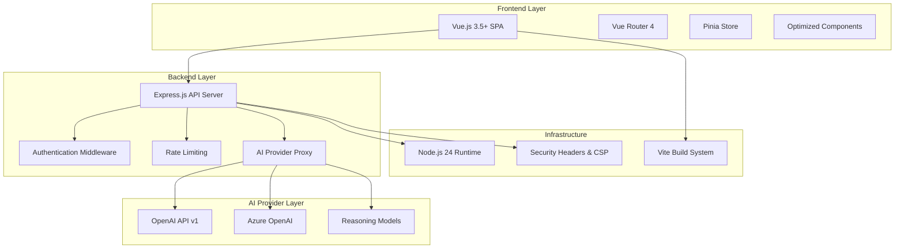
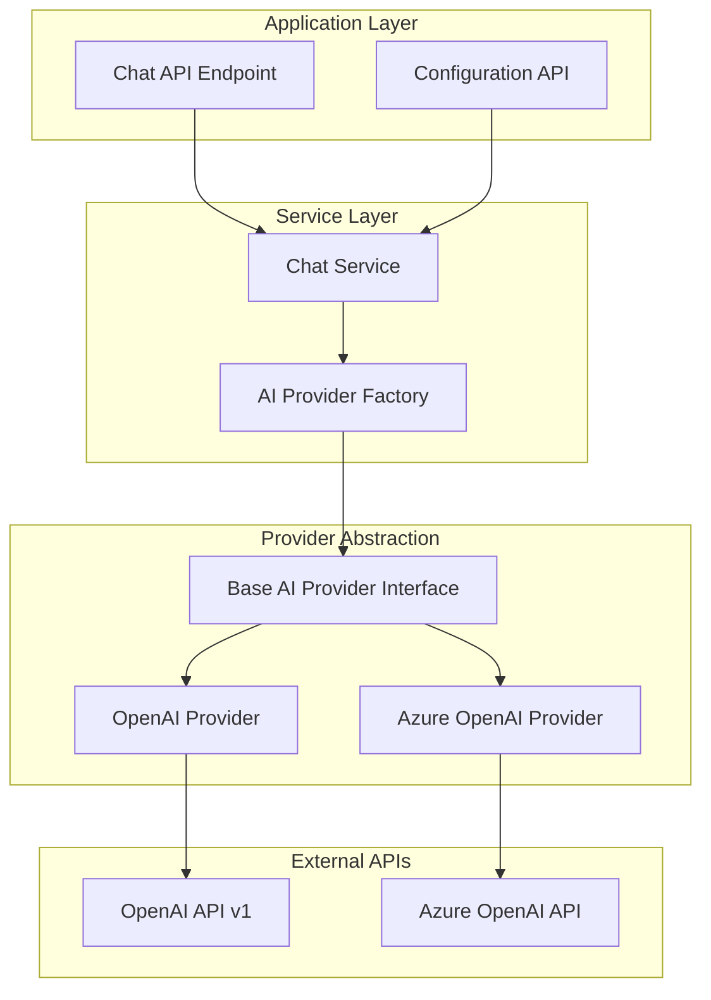

# Design Document

## Overview

The ChatGPT Web Modernization project transforms the existing ChatGPT web application into a modern, high-performance system leveraging Node.js 24, Vue.js 3.5+, and the latest OpenAI API v1 with native Azure OpenAI support. The design emphasizes performance optimization, type safety, security best practices, and maintainable architecture.

The modernization focuses on three core areas:

1. **Backend Modernization**: Upgrading to Node.js 24 with native fetch, implementing OpenAI v1 API with Azure support, and adding reasoning model capabilities
2. **Frontend Optimization**: Leveraging Vue 3.5+ features, optimizing build processes, and improving user experience
3. **Quality Assurance**: Achieving zero TypeScript errors/ESLint warnings, implementing security best practices, and establishing proper development workflows

## Architecture

### High-Level Architecture



### Provider Abstraction Architecture



## Components and Interfaces

### Core Interfaces

#### AI Provider Interface

```typescript
interface AIProvider {
  readonly name: string
  readonly supportedModels: string[]
  readonly supportsStreaming: boolean
  readonly supportsReasoning: boolean

  createChatCompletion: (request: ChatCompletionRequest) => Promise<ChatCompletionResponse>
  createStreamingChatCompletion: (
    request: ChatCompletionRequest,
  ) => AsyncIterable<ChatCompletionChunk>
  validateConfiguration: () => Promise<boolean>
  getUsageInfo: () => Promise<UsageInfo>
}

interface ChatCompletionRequest {
  messages: ChatMessage[]
  model: string
  temperature?: number
  maxTokens?: number
  stream?: boolean
  reasoningMode?: boolean
}

interface ChatMessage {
  role: 'system' | 'user' | 'assistant'
  content: string
  reasoning?: ReasoningStep[]
}

interface ReasoningStep {
  step: number
  thought: string
  confidence: number
}
```

#### Configuration Interface

```typescript
interface AppConfiguration {
  server: ServerConfig
  ai: AIConfig
  security: SecurityConfig
  development: DevelopmentConfig
}

interface AIConfig {
  provider: 'openai' | 'azure'
  openai?: OpenAIConfig
  azure?: AzureOpenAIConfig
  defaultModel: string
  enableReasoning: boolean
}

interface OpenAIConfig {
  apiKey: string
  baseUrl?: string
  organization?: string
}

interface AzureOpenAIConfig {
  apiKey: string
  endpoint: string
  deployment: string
  apiVersion: string
}
```

### Backend Components

#### Provider Factory

```typescript
class AIProviderFactory {
  static create(config: AIConfig): AIProvider {
    switch (config.provider) {
      case 'openai':
        return new OpenAIProvider(config.openai!)
      case 'azure':
        return new AzureOpenAIProvider(config.azure!)
      default:
        throw new Error(`Unsupported provider: ${config.provider}`)
    }
  }
}
```

#### OpenAI Provider Implementation

```typescript
class OpenAIProvider implements AIProvider {
  private client: OpenAI

  constructor(config: OpenAIConfig) {
    this.client = new OpenAI({
      apiKey: config.apiKey,
      baseURL: config.baseUrl,
      organization: config.organization,
    })
  }

  async createChatCompletion(request: ChatCompletionRequest): Promise<ChatCompletionResponse> {
    const response = await this.client.chat.completions.create({
      model: request.model,
      messages: request.messages,
      temperature: request.temperature,
      max_tokens: request.maxTokens,
      stream: false,
    })

    return this.transformResponse(response)
  }

  async *createStreamingChatCompletion(
    request: ChatCompletionRequest,
  ): AsyncIterable<ChatCompletionChunk> {
    const stream = await this.client.chat.completions.create({
      model: request.model,
      messages: request.messages,
      temperature: request.temperature,
      max_tokens: request.maxTokens,
      stream: true,
    })

    for await (const chunk of stream) {
      yield this.transformChunk(chunk)
    }
  }
}
```

#### Azure OpenAI Provider Implementation

```typescript
class AzureOpenAIProvider implements AIProvider {
  private client: AzureOpenAI

  constructor(config: AzureOpenAIConfig) {
    this.client = new AzureOpenAI({
      apiKey: config.apiKey,
      endpoint: config.endpoint,
      deployment: config.deployment,
      apiVersion: config.apiVersion,
    })
  }

  // Similar implementation with Azure-specific handling
}
```

### Frontend Components

#### Chat Store (Pinia)

```typescript
export const useChatStore = defineStore('chat', () => {
  const conversations = ref<Conversation[]>([])
  const currentConversation = ref<Conversation | null>(null)
  const isLoading = ref(false)
  const provider = ref<AIProvider>('openai')
  const model = ref<string>('gpt-4o')
  const reasoningEnabled = ref(false)

  const sendMessage = async (content: string) => {
    if (!currentConversation.value) return

    const userMessage: ChatMessage = {
      role: 'user',
      content,
      timestamp: Date.now(),
    }

    currentConversation.value.messages.push(userMessage)
    isLoading.value = true

    try {
      const response = await chatAPI.sendMessage({
        messages: currentConversation.value.messages,
        model: model.value,
        reasoningMode: reasoningEnabled.value,
      })

      currentConversation.value.messages.push(response)
    } catch (error) {
      handleError(error)
    } finally {
      isLoading.value = false
    }
  }

  return {
    conversations: readonly(conversations),
    currentConversation: readonly(currentConversation),
    isLoading: readonly(isLoading),
    sendMessage,
    // ... other actions
  }
})
```

#### Optimized Chat Component

```vue
<script setup lang="ts">
import { computed, ref, watch } from 'vue'
import { useReasoningDisplay } from '@/composables/useReasoningDisplay'
import { useChatStore } from '@/stores/chat'

interface Props {
  conversationId?: string
}

const props = withDefaults(defineProps<Props>(), {
  conversationId: undefined,
})

const chatStore = useChatStore()
const { displayReasoning, formatReasoningSteps } = useReasoningDisplay()

const messageInput = ref('')
const isComposing = ref(false)

const canSend = computed(
  () => messageInput.value.trim().length > 0 && !chatStore.isLoading && !isComposing.value,
)

async function handleSend() {
  if (!canSend.value) return

  const content = messageInput.value.trim()
  messageInput.value = ''

  await chatStore.sendMessage(content)
}

// Watch for conversation changes
watch(
  () => props.conversationId,
  newId => {
    if (newId) {
      chatStore.loadConversation(newId)
    }
  },
  { immediate: true },
)
</script>

<template>
  <div class="chat-container">
    <div class="messages-container">
      <div
        v-for="message in chatStore.currentConversation?.messages"
        :key="message.id"
        class="message"
        :class="message.role"
      >
        <div class="message-content">
          {{ message.content }}
        </div>

        <!-- Reasoning Steps Display -->
        <div v-if="message.reasoning && displayReasoning" class="reasoning-steps">
          <h4>Reasoning Process:</h4>
          <div
            v-for="step in formatReasoningSteps(message.reasoning)"
            :key="step.step"
            class="reasoning-step"
          >
            <span class="step-number">{{ step.step }}</span>
            <span class="step-thought">{{ step.thought }}</span>
            <span class="step-confidence">{{ step.confidence }}%</span>
          </div>
        </div>
      </div>
    </div>

    <div class="input-container">
      <textarea
        v-model="messageInput"
        :disabled="chatStore.isLoading"
        placeholder="Type your message..."
        @keydown.enter.exact.prevent="handleSend"
        @compositionstart="isComposing = true"
        @compositionend="isComposing = false"
      />
      <button :disabled="!canSend" @click="handleSend">Send</button>
    </div>
  </div>
</template>
```

## Data Models

### Core Data Models

```typescript
interface Conversation {
  id: string
  title: string
  messages: ChatMessage[]
  createdAt: number
  updatedAt: number
  model: string
  provider: AIProvider
  settings: ConversationSettings
}

interface ConversationSettings {
  temperature: number
  maxTokens: number
  systemMessage?: string
  reasoningEnabled: boolean
}

interface ChatMessage {
  id: string
  role: 'system' | 'user' | 'assistant'
  content: string
  timestamp: number
  reasoning?: ReasoningStep[]
  metadata?: MessageMetadata
}

interface MessageMetadata {
  model: string
  provider: string
  tokenCount?: number
  processingTime?: number
  cost?: number
}

interface ReasoningStep {
  step: number
  thought: string
  confidence: number
  duration?: number
}
```

### Configuration Models

```typescript
interface SystemConfiguration {
  version: string
  nodeVersion: string
  environment: 'development' | 'production' | 'test'
  features: FeatureFlags
  limits: SystemLimits
}

interface FeatureFlags {
  reasoningModels: boolean
  azureOpenAI: boolean
  streamingResponses: boolean
  conversationExport: boolean
}

interface SystemLimits {
  maxConversations: number
  maxMessagesPerConversation: number
  maxTokensPerRequest: number
  rateLimitPerHour: number
}
```

Now I need to use the prework tool to analyze the acceptance criteria before writing the Correctness Properties section:

<function_calls>
<invoke name="prework">
<parameter name="featureName">chatgpt-web-modernization

## Correctness Properties

_A property is a characteristic or behavior that should hold true across all valid executions of a system—essentially, a formal statement about what the system should do. Properties serve as the bridge between human-readable specifications and machine-verifiable correctness guarantees._

### Property Reflection

After analyzing all acceptance criteria, I identified several areas where properties can be consolidated to avoid redundancy:

- **API Client Properties**: Properties 3.1, 3.4, 4.1, and 4.3 can be combined into comprehensive API compatibility properties
- **Security Properties**: Properties 6.1, 6.5, 6.6, and 6.8 can be consolidated into input validation and security properties
- **Provider Abstraction Properties**: Properties 7.1, 7.2, 7.3, and 7.5 can be combined into provider interface consistency properties
- **Vue.js Feature Properties**: Properties 2.1, 2.2, and 2.3 can be consolidated into Vue.js modernization compliance

### Core Properties

**Property 1: Modern JavaScript Feature Compliance**
_For any_ JavaScript/TypeScript file in the codebase, it should use Node.js 24+ native features (like native fetch) instead of external polyfills where the native feature is available and appropriate
**Validates: Requirements 1.2, 1.5**

**Property 2: Vue.js Modernization Compliance**
_For any_ Vue component file, it should use Vue 3 Composition API with `<script setup>` syntax and leverage Vue 3.5+ performance features like `defineModel`, `defineEmits`, and reactive props destructuring where appropriate
**Validates: Requirements 2.1, 2.2, 2.3**

**Property 3: Route-Based Code Splitting**
_For any_ route definition in the application, components should be loaded using dynamic imports to enable proper code splitting and lazy loading
**Validates: Requirements 2.4, 8.5**

**Property 4: Async Component Suspense Usage**
_For any_ async component that requires loading time, it should be properly wrapped with Vue's Suspense component to handle loading states
**Validates: Requirements 2.6**

**Property 5: OpenAI API v1 Compatibility**
_For any_ OpenAI API request, the client should use v1 API endpoints with correct request/response formats and support all required endpoints (chat completions, embeddings, assistants)
**Validates: Requirements 3.1, 3.4**

**Property 6: Provider Endpoint Configuration**
_For any_ AI provider configuration (OpenAI or Azure), the system should correctly route requests to the appropriate base URLs and handle provider-specific authentication and formatting
**Validates: Requirements 3.2, 3.3, 3.5**

**Property 7: Streaming Response Support**
_For any_ chat completion request with streaming enabled, both OpenAI and Azure OpenAI providers should handle streaming responses correctly and consistently
**Validates: Requirements 3.6**

**Property 8: Provider Error Handling Consistency**
_For any_ error condition from AI providers, the error handling should be consistent across OpenAI and Azure OpenAI services and provide appropriate error messages
**Validates: Requirements 3.7, 7.4**

**Property 9: Reasoning Model Support**
_For any_ reasoning model request (o1, o1-mini), the client should handle model-specific parameters, limitations, and display reasoning steps when available in responses
**Validates: Requirements 4.1, 4.2, 4.3**

**Property 10: Reasoning Model UI Indicators**
_For any_ reasoning model selection in the UI, appropriate loading indicators and processing time warnings should be displayed to users
**Validates: Requirements 4.4**

**Property 11: Input Validation and Sanitization**
_For any_ user input received by the system, it should be properly validated, sanitized, and protected against malicious content including XSS attacks
**Validates: Requirements 6.1, 6.5, 6.6**

**Property 12: Security Headers Implementation**
_For any_ HTTP response from the server, it should include appropriate security headers (CSP, HSTS, X-Frame-Options) and not expose sensitive information
**Validates: Requirements 6.2, 6.8**

**Property 13: API Key Security**
_For any_ API key handling, keys should be stored securely, transmitted over secure channels, and never exposed in client-side code or logs
**Validates: Requirements 6.3**

**Property 14: Rate Limiting Enforcement**
_For any_ series of requests exceeding configured limits, the rate limiting system should properly throttle requests and return appropriate error responses
**Validates: Requirements 6.4**

**Property 15: Secure Session Management**
_For any_ user session, the session management should follow security best practices including secure cookies, proper expiration, and session invalidation
**Validates: Requirements 6.7**

**Property 16: Provider Interface Consistency**
_For any_ AI provider implementation, it should conform to the base provider interface and maintain consistent behavior when switching between providers
**Validates: Requirements 7.1, 7.2, 7.3, 7.5**

**Property 17: Request/Response Logging**
_For any_ API request made to AI providers, appropriate logging should be implemented for debugging while respecting security constraints
**Validates: Requirements 7.6**

**Property 18: Provider Rate Limit Handling**
_For any_ rate limit or quota exceeded condition from AI providers, the system should handle provider-specific limits appropriately with proper retry logic
**Validates: Requirements 7.7**

## Error Handling

### Error Categories and Handling Strategy

#### AI Provider Errors

- **Network Errors**: Implement exponential backoff retry with circuit breaker pattern
- **Authentication Errors**: Clear error messages with configuration guidance
- **Rate Limit Errors**: Respect provider-specific rate limits with appropriate delays
- **Model Errors**: Graceful fallback to alternative models when available

#### Application Errors

- **Validation Errors**: Clear user feedback with specific field-level errors
- **Configuration Errors**: Startup validation with detailed error messages
- **Runtime Errors**: Graceful degradation with user-friendly error states

#### Security Errors

- **Input Validation Failures**: Log security events without exposing system details
- **Authentication Failures**: Rate-limited responses to prevent brute force attacks
- **Authorization Errors**: Clear access denied messages without information leakage

### Error Response Format

```typescript
interface ErrorResponse {
  error: {
    code: string
    message: string
    details?: Record<string, any>
    timestamp: number
    requestId: string
  }
}
```

### Retry Strategy

```typescript
interface RetryConfig {
  maxAttempts: number
  baseDelay: number
  maxDelay: number
  backoffMultiplier: number
  retryableErrors: string[]
}
```

## Testing Strategy

### Dual Testing Approach

The testing strategy employs both **unit tests** and **property-based tests** as complementary approaches:

- **Unit tests** verify specific examples, edge cases, and integration points
- **Property tests** verify universal properties across all inputs through randomization
- Both are necessary for comprehensive coverage

### Property-Based Testing Configuration

- **Testing Library**: Fast-check for TypeScript/JavaScript property-based testing
- **Test Iterations**: Minimum 100 iterations per property test
- **Test Tagging**: Each property test tagged with format: **Feature: chatgpt-web-modernization, Property {number}: {property_text}**

### Unit Testing Focus Areas

- **API Integration**: Test specific OpenAI and Azure OpenAI request/response scenarios
- **Component Behavior**: Test Vue component interactions and state management
- **Security Measures**: Test input validation, sanitization, and security headers
- **Error Conditions**: Test specific error scenarios and edge cases
- **Configuration**: Test environment variable handling and provider selection

### Property Testing Focus Areas

- **Input Validation**: Test all possible user inputs for proper validation and sanitization
- **Provider Consistency**: Test that all providers maintain consistent interfaces
- **Security Properties**: Test that security measures work across all input variations
- **API Compatibility**: Test that API clients work correctly with all valid requests
- **UI Behavior**: Test that UI components behave correctly across all state variations

### Development Tools and Quality Assurance

#### Linting and Formatting Tool Selection

**ESLint Configuration**:

- **@antfu/eslint-config**: Modern, opinionated ESLint config with TypeScript support
- **Alternative consideration**: ESLint Flat Config with custom rules for better performance
- **Plugins**: Vue, TypeScript, Security, Import sorting
- **Rules**: Strict mode with zero warnings policy

**Code Formatting**:

- **Prettier**: Industry standard with Vue.js support
- **Alternative consideration**: Biome for faster formatting and linting (if mature enough)
- **Configuration**: Consistent with ESLint rules, integrated with IDE

**Type Checking**:

- **TypeScript 5.9+**: Latest version with strict configuration
- **Vue-tsc**: Vue-specific TypeScript checking
- **Configuration**: Strict mode with all strict flags enabled

**Pre-commit Hooks**:

- **Husky**: Git hooks management
- **lint-staged**: Run linters on staged files only
- **Commitizen**: Conventional commit message formatting

#### Tool Evaluation Criteria

1. **Performance**: Fast execution for development workflow
2. **Vue.js Support**: Native Vue 3.5+ support and optimization
3. **TypeScript Integration**: Seamless TypeScript experience
4. **Maintainability**: Active development and community support
5. **Configuration**: Minimal configuration with sensible defaults

### Testing Environment Requirements

- **Node.js 24**: All tests must run on Node.js 24 environment
- **TypeScript**: All tests written in TypeScript with strict type checking
- **Zero Warnings**: Test suite must produce zero ESLint warnings
- **Fast Execution**: Property tests optimized for development workflow speed
- **CI Integration**: Tests integrated into pre-commit hooks and CI pipeline

### Test Organization

```
tests/
├── unit/
│   ├── api/
│   │   ├── openai-provider.test.ts
│   │   ├── azure-provider.test.ts
│   │   └── provider-factory.test.ts
│   ├── components/
│   │   ├── chat-component.test.ts
│   │   └── reasoning-display.test.ts
│   └── security/
│       ├── input-validation.test.ts
│       └── security-headers.test.ts
├── properties/
│   ├── api-compatibility.property.test.ts
│   ├── security-validation.property.test.ts
│   ├── provider-consistency.property.test.ts
│   └── ui-behavior.property.test.ts
└── integration/
    ├── end-to-end.test.ts
    └── provider-switching.test.ts
```

Each property-based test will be annotated with its corresponding design property and requirements validation, ensuring traceability from requirements through design to implementation and testing.
