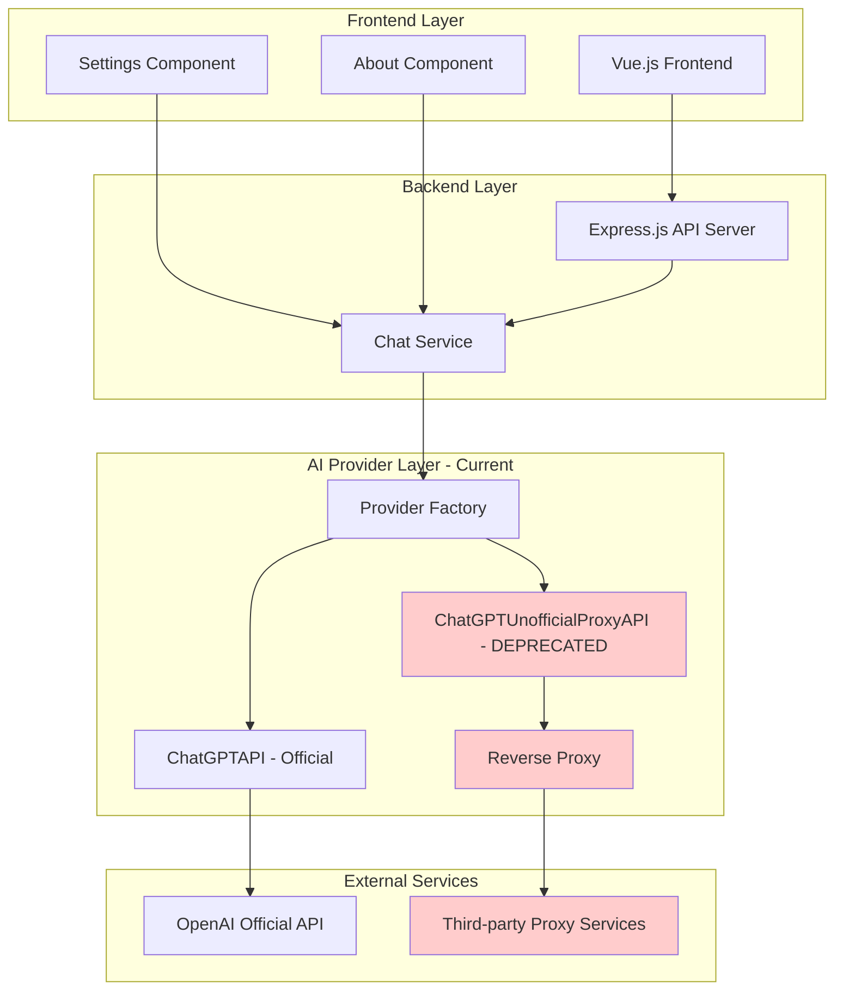
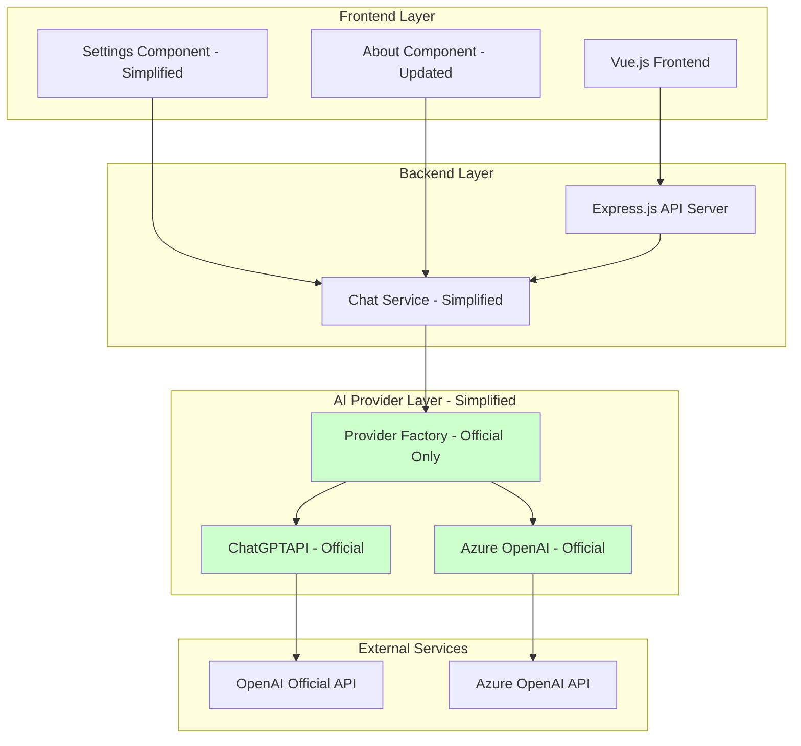

# Design Document

## Overview

The Remove Unofficial Proxy API project focuses on cleaning up the ChatGPT Web application by removing all support for the deprecated ChatGPT Unofficial Proxy API (web accessToken) method. This cleanup will simplify the codebase, improve security, and ensure the application only uses officially supported OpenAI API access methods.

The removal process involves:

1. **Backend Code Cleanup**: Removing ChatGPTUnofficialProxyAPI client, accessToken handling, and reverse proxy logic
2. **Configuration Simplification**: Eliminating unofficial API environment variables and validation
3. **Frontend Interface Updates**: Removing UI elements for unofficial API configuration
4. **Documentation Updates**: Updating all documentation to reflect official API-only support
5. **Migration Support**: Providing clear guidance for users transitioning from unofficial to official APIs

## Architecture

### Current Architecture (Before Cleanup)



### Target Architecture (After Cleanup)



## Components and Interfaces

### Backend Components to Remove

#### ChatGPTUnofficialProxyAPI Integration

```typescript
// TO BE REMOVED - Current unofficial API integration
interface ChatGPTUnofficialProxyAPIOptions {
	accessToken: string
	apiReverseProxyUrl?: string
	model?: string
	debug?: boolean
	headers?: Record<string, string>
	fetch?: FetchFn
}

// TO BE REMOVED - Current API model type
type ApiModel = 'ChatGPTAPI' | 'ChatGPTUnofficialProxyAPI' | undefined
```

#### Simplified Provider Architecture

```typescript
// UPDATED - Simplified API model type (official only)
type ApiModel = 'ChatGPTAPI' | 'AzureOpenAI' | undefined

// UPDATED - Simplified model configuration
interface ModelConfig {
	apiModel?: ApiModel
	timeoutMs?: number
	socksProxy?: string
	httpsProxy?: string
	usage?: string
	// REMOVED: reverseProxy, accessToken fields
}

// UPDATED - Simplified request properties
interface RequestProps {
	prompt: string
	options?: ChatContext
	systemMessage: string
	temperature?: number
	top_p?: number
}
```

### Updated Backend Service Implementation

#### Simplified Chat Service

```typescript
// UPDATED - service/src/chatgpt/index.ts
import type { ChatGPTAPIOptions, ChatMessage, SendMessageOptions } from 'chatgpt'
import type { ApiModel, ChatContext, ModelConfig } from '../types'
import { ChatGPTAPI } from 'chatgpt' // REMOVED: ChatGPTUnofficialProxyAPI import
import { sendResponse } from '../utils'
import { isNotEmptyString } from '../utils/is'

// UPDATED - Only support official API key
const openAiApiKey = process.env.OPENAI_API_KEY
// REMOVED: const accessToken = process.env.OPENAI_ACCESS_TOKEN

// UPDATED - Simplified validation
if (!isNotEmptyString(openAiApiKey)) {
	throw new Error(
		'Missing OPENAI_API_KEY environment variable. Please provide a valid OpenAI API key.',
	)
}

let api: ChatGPTAPI // REMOVED: | ChatGPTUnofficialProxyAPI

// UPDATED - Simplified initialization (official API only)
async function initializeAPI() {
	const openAiApiBaseUrl = process.env.OPENAI_API_BASE_URL

	const options: ChatGPTAPIOptions = {
		apiKey: openAiApiKey,
		completionParams: { model },
		debug: !disableDebug,
	}

	// Model-specific token limits configuration
	configureModelLimits(options, model)

	if (isNotEmptyString(openAiApiBaseUrl)) {
		options.apiBaseUrl = openAiApiBaseUrl.includes('/v1')
			? openAiApiBaseUrl
			: `${openAiApiBaseUrl}/v1`
	}

	setupProxy(options)
	api = new ChatGPTAPI({ ...options })
	apiModel = 'ChatGPTAPI'
}

// UPDATED - Simplified chat processing (no unofficial API handling)
async function chatReplyProcess(options: RequestOptions) {
	const { message, lastContext, process, systemMessage, temperature, top_p } = options

	try {
		let sendOptions: SendMessageOptions = { timeoutMs }

		// Only handle official API options
		if (isNotEmptyString(systemMessage)) {
			sendOptions.systemMessage = systemMessage
		}

		sendOptions.completionParams = { model, temperature, top_p }

		if (lastContext != null) {
			sendOptions.parentMessageId = lastContext.parentMessageId
		}

		const response = await api.sendMessage(message, {
			...sendOptions,
			onProgress: partialResponse => {
				process?.(partialResponse)
			},
		})

		return sendResponse({ type: 'Success', data: response })
	} catch (error: unknown) {
		return handleAPIError(error)
	}
}

// UPDATED - Simplified configuration (no reverse proxy info)
async function chatConfig() {
	const usage = await fetchUsage()
	const httpsProxy = (process.env.HTTPS_PROXY || process.env.ALL_PROXY) ?? '-'
	const socksProxy =
		process.env.SOCKS_PROXY_HOST && process.env.SOCKS_PROXY_PORT
			? `${process.env.SOCKS_PROXY_HOST}:${process.env.SOCKS_PROXY_PORT}`
			: '-'

	return sendResponse<ModelConfig>({
		type: 'Success',
		data: {
			apiModel,
			timeoutMs,
			socksProxy,
			httpsProxy,
			usage,
			// REMOVED: reverseProxy field
		},
	})
}
```

#### Configuration Validation

```typescript
// NEW - Configuration validation service
class ConfigurationValidator {
	static validateEnvironment(): void {
		const deprecatedVars = ['OPENAI_ACCESS_TOKEN', 'API_REVERSE_PROXY']

		const foundDeprecated = deprecatedVars.filter(varName => process.env[varName] !== undefined)

		if (foundDeprecated.length > 0) {
			const errorMessage = `
Deprecated configuration detected: ${foundDeprecated.join(', ')}

The ChatGPT Unofficial Proxy API is no longer supported. 
Please migrate to the official OpenAI API:

1. Remove: ${foundDeprecated.join(', ')}
2. Set: OPENAI_API_KEY=your_official_api_key
3. Optionally set: OPENAI_API_BASE_URL=https://api.openai.com

Get your API key at: https://platform.openai.com/api-keys
      `.trim()

			throw new Error(errorMessage)
		}

		if (!isNotEmptyString(process.env.OPENAI_API_KEY)) {
			throw new Error(
				`
Missing required configuration: OPENAI_API_KEY

Please set your official OpenAI API key:
OPENAI_API_KEY=your_official_api_key

Get your API key at: https://platform.openai.com/api-keys
      `.trim(),
			)
		}
	}

	static getValidatedConfig(): ValidatedConfig {
		this.validateEnvironment()

		return {
			apiKey: process.env.OPENAI_API_KEY!,
			baseUrl: process.env.OPENAI_API_BASE_URL,
			model: process.env.OPENAI_API_MODEL || 'gpt-3.5-turbo',
			timeout: Number(process.env.TIMEOUT_MS) || 100000,
		}
	}
}

interface ValidatedConfig {
	apiKey: string
	baseUrl?: string
	model: string
	timeout: number
}
```

### Frontend Components to Update

#### Settings Component Updates

```vue
<!-- UPDATED - src/components/common/Setting/About.vue -->
<script setup lang="ts">
import { computed, ref } from 'vue'
import { useAuthStore, useChatStore } from '@/store'

interface ConfigState {
	timeoutMs?: number
	apiModel?: string
	socksProxy?: string
	httpsProxy?: string
	usage?: string
	// REMOVED: reverseProxy field
}

const authStore = useAuthStore()
const chatStore = useChatStore()

const loading = ref(false)
const config = ref<ConfigState>()

// UPDATED - Only show official API information
const isChatGPTAPI = computed<boolean>(
	() => !!config.value?.apiModel && config.value.apiModel === 'ChatGPTAPI',
)

async function fetchConfig() {
	try {
		loading.value = true
		const { data } = await chatStore.fetchConfig<ConfigState>()
		config.value = data
	} finally {
		loading.value = false
	}
}

fetchConfig()
</script>

<template>
	<div class="p-4 space-y-4">
		<h2 class="text-xl font-bold">{{ $t('setting.config') }}</h2>

		<div v-if="loading" class="flex justify-center">
			<div class="loading-spinner" />
		</div>

		<div v-else-if="config" class="space-y-2">
			<p>
				<span class="font-medium">{{ $t('setting.api') }}:</span>
				<span v-if="isChatGPTAPI" class="text-green-600">{{ $t('setting.officialAPI') }}</span>
				<span v-else class="text-red-600">{{ $t('setting.unknownAPI') }}</span>
			</p>

			<!-- REMOVED: Reverse proxy information display -->

			<p>
				<span class="font-medium">{{ $t('setting.timeout') }}:</span>
				{{ config?.timeoutMs ?? '-' }}
			</p>

			<p>
				<span class="font-medium">{{ $t('setting.socksProxy') }}:</span>
				{{ config?.socksProxy ?? '-' }}
			</p>

			<p>
				<span class="font-medium">{{ $t('setting.httpsProxy') }}:</span>
				{{ config?.httpsProxy ?? '-' }}
			</p>

			<p v-if="isChatGPTAPI">
				<span class="font-medium">{{ $t('setting.usage') }}:</span>
				{{ config?.usage ?? '-' }}
			</p>
		</div>

		<!-- NEW - Migration guidance for users -->
		<div class="mt-6 p-4 bg-blue-50 border border-blue-200 rounded-lg">
			<h3 class="font-medium text-blue-800">{{ $t('setting.migrationNotice') }}</h3>
			<p class="text-sm text-blue-700 mt-1">
				{{ $t('setting.migrationDescription') }}
			</p>
			<a
				href="https://platform.openai.com/api-keys"
				target="_blank"
				class="text-blue-600 underline text-sm"
			>
				{{ $t('setting.getAPIKey') }}
			</a>
		</div>
	</div>
</template>
```

#### Localization Updates

```typescript
// UPDATED - Add new localization keys for migration guidance
const migrationKeys = {
	'setting.officialAPI': 'Official OpenAI API',
	'setting.unknownAPI': 'Unknown API Configuration',
	'setting.migrationNotice': 'Using Official OpenAI API',
	'setting.migrationDescription':
		'This application now only supports the official OpenAI API for better security and reliability.',
	'setting.getAPIKey': 'Get your API key here',
}

// REMOVED - Remove unofficial API related keys
const removedKeys = ['setting.reverseProxy', 'setting.accessToken', 'setting.unofficialAPI']
```

## Data Models

### Updated Type Definitions

```typescript
// UPDATED - service/src/types.ts
export interface RequestProps {
	prompt: string
	options?: ChatContext
	systemMessage: string
	temperature?: number
	top_p?: number
}

export interface ChatContext {
	conversationId?: string
	parentMessageId?: string
}

// REMOVED - ChatGPTUnofficialProxyAPIOptions interface

export interface ModelConfig {
	apiModel?: ApiModel
	timeoutMs?: number
	socksProxy?: string
	httpsProxy?: string
	usage?: string
	// REMOVED: reverseProxy field
}

// UPDATED - Simplified API model type
export type ApiModel = 'ChatGPTAPI' | 'AzureOpenAI' | undefined

// NEW - Migration support types
export interface MigrationInfo {
	hasDeprecatedConfig: boolean
	deprecatedVars: string[]
	migrationSteps: string[]
}

export interface ValidationResult {
	isValid: boolean
	errors: string[]
	warnings: string[]
}
```

### Environment Configuration

```typescript
// NEW - Environment configuration schema
interface EnvironmentConfig {
	// Required
	OPENAI_API_KEY: string

	// Optional
	OPENAI_API_BASE_URL?: string
	OPENAI_API_MODEL?: string
	OPENAI_API_DISABLE_DEBUG?: string
	TIMEOUT_MS?: string
	MAX_REQUEST_PER_HOUR?: string
	AUTH_SECRET_KEY?: string

	// Proxy settings (retained)
	SOCKS_PROXY_HOST?: string
	SOCKS_PROXY_PORT?: string
	SOCKS_PROXY_USERNAME?: string
	SOCKS_PROXY_PASSWORD?: string
	HTTPS_PROXY?: string
	ALL_PROXY?: string

	// REMOVED - Deprecated variables
	// OPENAI_ACCESS_TOKEN?: string
	// API_REVERSE_PROXY?: string
}
```

## Correctness Properties

_A property is a characteristic or behavior that should hold true across all valid executions of a system—essentially, a formal statement about what the system should do. Properties serve as the bridge between human-readable specifications and machine-verifiable correctness guarantees._

### Property Reflection

After analyzing all acceptance criteria, I identified several areas where properties can be consolidated to avoid redundancy:

- **Code Cleanup Properties**: Properties 1.1, 1.2, 1.3, 1.4 can be combined into comprehensive codebase scanning properties
- **Configuration Properties**: Properties 2.1, 2.2, 2.3, 2.4, 2.5 can be consolidated into configuration validation properties
- **Frontend Properties**: Properties 3.1, 3.2, 3.3, 3.4, 3.5 can be combined into UI cleanup properties
- **Provider Architecture Properties**: Properties 4.1, 4.2, 4.3, 4.4, 4.5 can be consolidated into provider simplification properties
- **Documentation Properties**: Properties 5.1, 5.2, 5.3, 5.4, 5.6 can be combined into documentation cleanup properties
- **Security Properties**: Properties 7.1, 7.2, 7.3, 7.4, 7.5 can be consolidated into security cleanup properties

### Core Properties

**Property 1: Unofficial API Code Removal**
_For any_ file in the codebase, it should not contain references to ChatGPTUnofficialProxyAPI, accessToken authentication, web scraping, or browser automation code
**Validates: Requirements 1.1, 1.2, 1.3, 1.4**

**Property 2: Dependency Cleanup**
_For any_ package.json or dependency configuration file, it should not contain dependencies specific to unofficial proxy functionality
**Validates: Requirements 1.5**

**Property 3: Configuration Variable Removal**
_For any_ configuration file or environment variable reference in the code, it should not include OPENAI_ACCESS_TOKEN, API_REVERSE_PROXY, or other unofficial API variables
**Validates: Requirements 2.1, 2.2**

**Property 4: Official API Configuration Validation**
_For any_ configuration input to the system, only official OpenAI API and Azure OpenAI configuration options should be accepted and validated
**Validates: Requirements 2.3, 2.4**

**Property 5: Startup Configuration Validation**
_For any_ application startup with deprecated configuration variables present, the service should fail to start with helpful error messages
**Validates: Requirements 2.5, 6.3, 6.5**

**Property 6: Frontend UI Cleanup**
_For any_ Vue component or template file, it should not contain UI elements, input fields, or status indicators related to unofficial proxy API configuration
**Validates: Requirements 3.1, 3.2, 3.3, 3.5**

**Property 7: Frontend Help Text Updates**
_For any_ localization file or help text in the frontend, it should only reference official API usage and not mention unofficial proxy APIs
**Validates: Requirements 3.4**

**Property 8: Provider Architecture Simplification**
_For any_ provider factory or interface definition, it should only support creating and managing official OpenAI and Azure OpenAI providers
**Validates: Requirements 4.1, 4.2, 4.3, 4.5**

**Property 9: Error Handling Cleanup**
_For any_ error handling code in the backend, it should not contain unofficial proxy-specific error handling or retry logic
**Validates: Requirements 4.4**

**Property 10: Documentation Cleanup**
_For any_ documentation file (README, setup guides, troubleshooting), it should only contain official API setup instructions and not reference unofficial proxy APIs
**Validates: Requirements 5.1, 5.2, 5.3, 5.4, 5.6**

**Property 11: Migration Warning System**
_For any_ deprecated configuration detected at startup, the system should log clear deprecation warnings and provide migration guidance
**Validates: Requirements 6.1, 6.2**

**Property 12: Security Risk Removal**
_For any_ security-related code in the backend, it should not contain web scraping, unofficial token handling, or unofficial proxy-related security vulnerabilities
**Validates: Requirements 7.1, 7.2, 7.4**

**Property 13: Authentication Method Validation**
_For any_ authentication attempt, only official API key methods should be supported and accepted
**Validates: Requirements 7.3, 7.5**

**Property 14: Test Suite Cleanup**
_For any_ test file in the codebase, it should not contain tests related to unofficial API functionality
**Validates: Requirements 8.2**

## Error Handling

### Error Categories and Handling Strategy

#### Configuration Errors

- **Deprecated Configuration Detection**: Clear error messages with migration guidance
- **Missing Required Configuration**: Helpful error messages with setup instructions
- **Invalid Configuration Values**: Validation errors with correct format examples

#### Migration Support Errors

- **Legacy Environment Variables**: Startup failure with migration steps
- **Incomplete Migration**: Warnings with remaining steps to complete
- **Configuration Conflicts**: Clear resolution guidance

### Error Response Format

```typescript
interface ConfigurationError {
	type: 'DEPRECATED_CONFIG' | 'MISSING_CONFIG' | 'INVALID_CONFIG'
	message: string
	deprecatedVars?: string[]
	migrationSteps?: string[]
	helpUrl?: string
}

interface MigrationGuidance {
	title: string
	description: string
	steps: MigrationStep[]
	resources: Resource[]
}

interface MigrationStep {
	action: string
	description: string
	example?: string
}

interface Resource {
	title: string
	url: string
	description: string
}
```

### Migration Error Messages

```typescript
const MIGRATION_MESSAGES = {
	DEPRECATED_ACCESS_TOKEN: {
		title: 'Deprecated Configuration Detected',
		message:
			'OPENAI_ACCESS_TOKEN is no longer supported. Please migrate to the official OpenAI API.',
		steps: [
			{
				action: 'Remove OPENAI_ACCESS_TOKEN',
				description: 'Delete the OPENAI_ACCESS_TOKEN environment variable',
			},
			{
				action: 'Set OPENAI_API_KEY',
				description: 'Add your official OpenAI API key',
				example: 'OPENAI_API_KEY=sk-...',
			},
			{
				action: 'Remove API_REVERSE_PROXY',
				description: 'Delete the API_REVERSE_PROXY environment variable if present',
			},
		],
		resources: [
			{
				title: 'Get OpenAI API Key',
				url: 'https://platform.openai.com/api-keys',
				description: 'Create and manage your OpenAI API keys',
			},
		],
	},
}
```

## Testing Strategy

### Dual Testing Approach

The testing strategy employs both **unit tests** and **property-based tests** as complementary approaches:

- **Unit tests** verify specific cleanup scenarios, migration examples, and error conditions
- **Property tests** verify universal cleanup properties across all files and configurations
- Both are necessary for comprehensive validation of the cleanup process

### Property-Based Testing Configuration

- **Testing Library**: Fast-check for TypeScript/JavaScript property-based testing
- **Test Iterations**: Minimum 100 iterations per property test
- **Test Tagging**: Each property test tagged with format: **Feature: remove-unofficial-proxy-api, Property {number}: {property_text}**

### Unit Testing Focus Areas

- **Specific Migration Scenarios**: Test migration from specific deprecated configurations
- **Error Message Validation**: Test that error messages contain expected migration guidance
- **Configuration Validation**: Test specific valid and invalid configuration combinations
- **Component Updates**: Test that specific UI components no longer show deprecated options
- **Documentation Examples**: Test that specific documentation sections are updated correctly

### Property Testing Focus Areas

- **Codebase Scanning**: Test that no files contain deprecated API references
- **Configuration Validation**: Test that all possible deprecated configurations are rejected
- **UI Component Cleanup**: Test that all UI components are free of deprecated elements
- **Documentation Consistency**: Test that all documentation files are consistent with official API only
- **Security Cleanup**: Test that all security-related code is free of deprecated vulnerabilities

### Cleanup Validation Tests

#### Codebase Scanning Tests

```typescript
// Property test for codebase cleanup
describe('Codebase Cleanup Properties', () => {
	test('Property 1: No unofficial API references in codebase', async () => {
		const deprecatedPatterns = [
			/ChatGPTUnofficialProxyAPI/g,
			/accessToken/g,
			/API_REVERSE_PROXY/g,
			/OPENAI_ACCESS_TOKEN/g,
			/reverseProxy/g,
		]

		const codeFiles = await getAllCodeFiles()

		for (const file of codeFiles) {
			const content = await readFile(file)
			for (const pattern of deprecatedPatterns) {
				expect(content).not.toMatch(pattern)
			}
		}
	})
})
```

#### Configuration Validation Tests

```typescript
// Property test for configuration validation
describe('Configuration Validation Properties', () => {
	test('Property 4: Only official API configurations accepted', () => {
		fc.assert(
			fc.property(
				fc.record({
					OPENAI_API_KEY: fc.string(),
					OPENAI_API_BASE_URL: fc.option(fc.webUrl()),
					OPENAI_API_MODEL: fc.option(fc.string()),
				}),
				config => {
					const result = ConfigurationValidator.validate(config)
					expect(result.isValid).toBe(true)
				},
			),
		)
	})

	test('Property 5: Deprecated configurations rejected', () => {
		fc.assert(
			fc.property(
				fc.record({
					OPENAI_ACCESS_TOKEN: fc.string(),
					API_REVERSE_PROXY: fc.option(fc.webUrl()),
				}),
				config => {
					expect(() => ConfigurationValidator.validate(config)).toThrow(/deprecated configuration/i)
				},
			),
		)
	})
})
```

### Test Organization

```
tests/
├── unit/
│   ├── configuration/
│   │   ├── migration-validation.test.ts
│   │   ├── error-messages.test.ts
│   │   └── startup-validation.test.ts
│   ├── components/
│   │   ├── settings-cleanup.test.ts
│   │   └── about-component.test.ts
│   └── documentation/
│       ├── readme-updates.test.ts
│       └── migration-guide.test.ts
├── properties/
│   ├── codebase-cleanup.property.test.ts
│   ├── configuration-validation.property.test.ts
│   ├── ui-cleanup.property.test.ts
│   └── documentation-consistency.property.test.ts
└── integration/
    ├── end-to-end-cleanup.test.ts
    └── migration-workflow.test.ts
```

Each property-based test will be annotated with its corresponding design property and requirements validation, ensuring traceability from requirements through design to implementation and testing.

```

Now I need to use the prework tool to analyze the acceptance criteria before writing the Correctness Properties section:

<function_calls>
<invoke name="prework">
<parameter name="featureName">remove-unofficial-proxy-api
```
