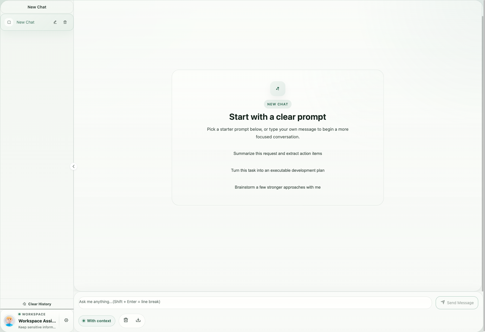
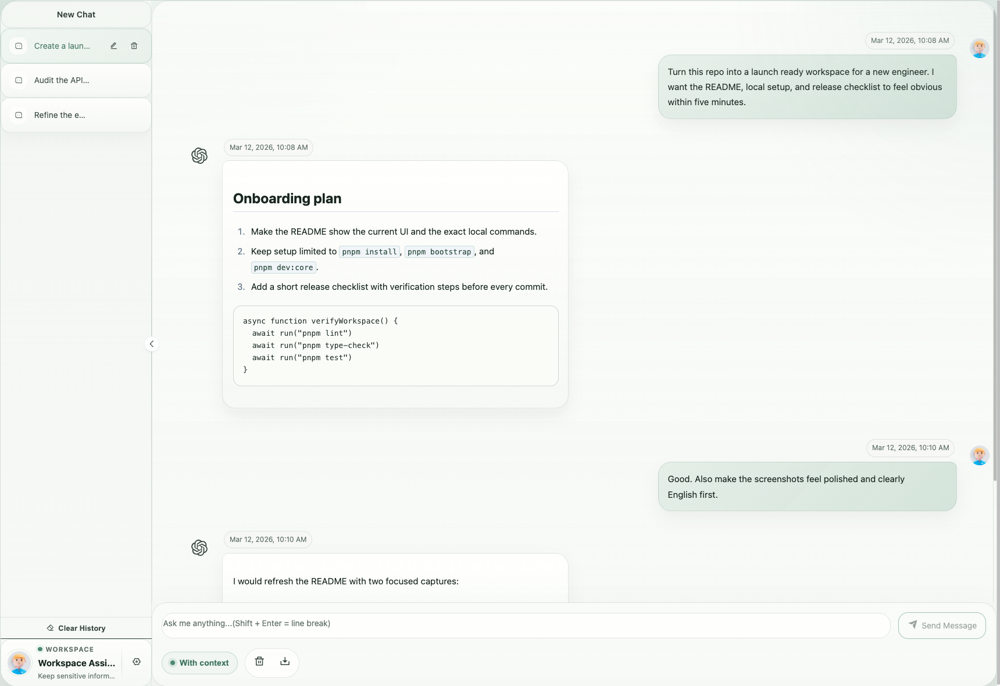

# ChatGPT Web

> 声明：此项目基于原开源项目进行修改和优化，遵循 MIT 协议，免费且作为开源学习使用。并且不会有任何形式的卖号、付费服务、讨论群、讨论组等行为。谨防受骗。

> 原项目地址：https://github.com/Chanzhaoyu/chatgpt-web

[English](README.md)




- [ChatGPT Web](#chatgpt-web)
  - [介绍](#介绍)
  - [待实现路线](#待实现路线)
  - [前置要求](#前置要求)
    - [Node](#node)
    - [PNPM](#pnpm)
    - [填写密钥](#填写密钥)
  - [安装依赖](#安装依赖)
    - [后端](#后端)
    - [前端](#前端)
  - [测试环境运行](#测试环境运行)
    - [后端服务](#后端服务)
    - [前端网页](#前端网页)
  - [环境变量](#环境变量)
  - [打包](#打包)
    - [使用 Docker](#使用-docker)
      - [Docker 参数示例](#docker-参数示例)
      - [Docker build \& Run](#docker-build--run)
      - [Docker compose](#docker-compose)
      - [防止爬虫抓取](#防止爬虫抓取)
    - [使用 Railway 部署](#使用-railway-部署)
      - [Railway 环境变量](#railway-环境变量)
    - [使用 Sealos 部署](#使用-sealos-部署)
    - [手动打包](#手动打包)
      - [后端服务](#后端服务-1)
      - [前端网页](#前端网页-1)
  - [常见问题](#常见问题)
  - [参与贡献](#参与贡献)
  - [致谢](#致谢)
  - [赞助](#赞助)
  - [License](#license)

## 介绍

此 ChatGPT Web 应用程序为与 OpenAI 官方 ChatGPT API 交互提供了一个简洁、现代的界面。该应用程序仅支持官方 OpenAI API 访问方法，以增强安全性和可靠性。

**支持的 API 方法：**

- **OpenAI 官方 API**：通过 OpenAI 官方 API 使用 `gpt-4o`、`gpt-4o-mini`、`gpt-4-turbo` 和其他现代模型
- **Azure OpenAI**：支持 Azure OpenAI 服务用于企业部署

**安全性和可靠性：**

- 仅支持官方 API 方法以确保最大安全性
- 不使用非官方代理服务器或网页抓取方法
- 直接与 OpenAI 官方端点集成
- 安全的 API 密钥认证

**设置：**

1. 进入 `service/.env.example` 文件，复制内容到 `service/.env` 文件
2. 使用您的官方 OpenAI API 密钥填写 `OPENAI_API_KEY` 字段 [(获取 apiKey)](https://platform.openai.com/api-keys)
3. 可选择配置 `OPENAI_API_BASE_URL` 用于自定义端点或 Azure OpenAI

**从非官方 API 迁移：**

如果您之前使用非官方代理 API（accessToken 方法），您需要迁移到官方 API：

1. **从您的 `.env` 文件中删除已弃用的变量**：
   - `OPENAI_ACCESS_TOKEN`
   - `API_REVERSE_PROXY`

2. **添加官方 API 配置**：
   - `OPENAI_API_KEY=sk-your_official_api_key_here`
   - 可选：`OPENAI_API_BASE_URL=https://api.openai.com`（如果使用自定义端点）

3. **获取您的官方 API 密钥**：访问 [OpenAI API Keys](https://platform.openai.com/api-keys) 创建您的 API 密钥

4. **重要**：非官方代理 API 方法已因安全性和可靠性原因被完全移除

环境变量：

全部参数变量请查看或[这里](#环境变量)

```
/service/.env.example
```

## 待实现路线

[✓] 双模型

[✓] 多会话储存和上下文逻辑

[✓] 对代码等消息类型的格式化美化处理

[✓] 访问权限控制

[✓] 数据导入、导出

[✓] 保存消息到本地图片

[✓] 界面多语言

[✓] 界面主题

[✗] More...

## 前置要求

### Node

`node` 需要 `^24` 版本，使用 [nvm](https://github.com/nvm-sh/nvm) 可管理本地多个 `node` 版本

```shell
node -v
```

### PNPM

如果你没有安装过 `pnpm`

```shell
npm install pnpm -g
```

### 填写密钥

获取您的官方 `OpenAI API Key` 并填写本地环境变量。访问 [OpenAI API Keys](https://platform.openai.com/api-keys) 创建您的 API 密钥。

```
# service/.env 文件

# OpenAI API Key - https://platform.openai.com/api-keys
OPENAI_API_KEY=sk-your_official_api_key_here

# 可选：自定义 API 基础 URL（用于 Azure OpenAI 或其他兼容端点）
OPENAI_API_BASE_URL=https://api.openai.com
```

**迁移提醒**：如果您之前使用 `OPENAI_ACCESS_TOKEN` 或 `API_REVERSE_PROXY`，这些已不再支持。请迁移到上述官方 API 密钥方法。

## 安装依赖

> 为了简便 `后端开发人员` 的了解负担，所以并没有采用前端 `workspace` 模式，而是分文件夹存放。如果只需要前端页面做二次开发，删除 `service` 文件夹即可。

### 后端

进入文件夹 `/service` 运行以下命令

```shell
pnpm install
```

### 前端

根目录下运行以下命令

```shell
pnpm bootstrap
```

## 测试环境运行

### 推荐开发方式

根目录下运行以下命令启动前端和后端服务：

```shell
pnpm dev:core
```

这将启动：

- 前端服务：http://localhost:1002
- 后端服务：http://localhost:3002

### 其他开发命令

```shell
# 启动所有服务（包括文档服务器）
pnpm dev

# 仅启动前端服务
pnpm dev:web

# 仅启动后端服务
pnpm dev:api
```

### 传统方式（分别启动）

#### 后端服务

进入文件夹 `/service` 运行以下命令

```shell
pnpm start
```

#### 前端网页

根目录下运行以下命令

```shell
pnpm dev:web
```

## 环境变量

**必需变量：**

- `OPENAI_API_KEY` - 您的官方 OpenAI API 密钥 [(获取 apiKey)](https://platform.openai.com/api-keys)

**可选 API 配置：**

- `OPENAI_API_MODEL` - 设置模型，可选，默认：`gpt-4o`
- `OPENAI_API_BASE_URL` - 设置接口地址，可选，默认：`https://api.openai.com`
- `OPENAI_API_DISABLE_DEBUG` - 设置接口关闭 debug 日志，可选，默认：empty 不关闭

**通用配置：**

- `AUTH_SECRET_KEY` - 访问权限密钥，可选
- `MAX_REQUEST_PER_HOUR` - 每小时最大请求次数，可选，默认无限
- `TIMEOUT_MS` - 超时，单位毫秒，可选
- `SOCKS_PROXY_HOST` 和 `SOCKS_PROXY_PORT` - Socks 代理配置，两者需同时设置，可选
- `SOCKS_PROXY_USERNAME` 和 `SOCKS_PROXY_PASSWORD` - Socks 代理认证，可选
- `HTTPS_PROXY` - 支持 `http`，`https`, `socks5`，可选
- `ALL_PROXY` - 支持 `http`，`https`, `socks5`，可选

**已弃用变量（不再支持）：**

以下环境变量已被移除，不再支持：

- ~~`OPENAI_ACCESS_TOKEN`~~ - 请使用 `OPENAI_API_KEY` 替代
- ~~`API_REVERSE_PROXY`~~ - 官方 API 不再需要

**迁移指南：**

如果您的配置中有任何已弃用的变量：

1. **删除** 这些变量从您的 `.env` 文件：

   ```bash
   # 删除这些行
   OPENAI_ACCESS_TOKEN=xxx
   API_REVERSE_PROXY=xxx
   ```

2. **添加** 官方 API 密钥：

   ```bash
   # 添加这行
   OPENAI_API_KEY=sk-your_official_api_key_here
   ```

3. **获取您的 API 密钥** 从 [OpenAI API Keys](https://platform.openai.com/api-keys)

## 打包

### 使用 Docker

#### Docker 参数示例


#### Docker build & Run

```bash
docker build -t chatgpt-web .

# 前台运行
docker run --name chatgpt-web --rm -it -p 127.0.0.1:3002:3002 --env OPENAI_API_KEY=your_api_key chatgpt-web

# 后台运行
docker run --name chatgpt-web -d -p 127.0.0.1:3002:3002 --env OPENAI_API_KEY=your_api_key chatgpt-web

# 运行地址
http://localhost:3002/
```

#### Docker compose

[Hub 地址](https://hub.docker.com/repository/docker/chenzhaoyu94/chatgpt-web/general)

```yml
version: '3'

services:
  app:
    image: chenzhaoyu94/chatgpt-web # 总是使用 latest ,更新时重新 pull 该 tag 镜像即可
    ports:
      - 127.0.0.1:3002:3002
    environment:
      # 必需：OpenAI API 密钥
      OPENAI_API_KEY: sk-your_official_api_key_here
      # 可选：API接口地址
      OPENAI_API_BASE_URL: https://api.openai.com
      # 可选：API模型，推荐使用最新模型
      # gpt-4o, gpt-4o-mini, gpt-4-turbo, gpt-4, o1, o1-preview, o1-mini
      OPENAI_API_MODEL: gpt-4o
      # 可选：访问权限密钥
      AUTH_SECRET_KEY: your_secret_key
      # 可选：每小时最大请求次数，默认无限
      MAX_REQUEST_PER_HOUR: 0
      # 可选：超时，单位毫秒
      TIMEOUT_MS: 60000
      # 可选：Socks代理，和 SOCKS_PROXY_PORT 一起时生效
      SOCKS_PROXY_HOST: xxx
      # 可选：Socks代理端口，和 SOCKS_PROXY_HOST 一起时生效
      SOCKS_PROXY_PORT: xxx
      # 可选：Socks代理用户名
      SOCKS_PROXY_USERNAME: xxx
      # 可选：Socks代理密码
      SOCKS_PROXY_PASSWORD: xxx
      # 可选：HTTPS 代理，支持 http，https，socks5
      HTTPS_PROXY: http://xxx:7890
```

- `OPENAI_API_BASE_URL` 可选，设置 `OPENAI_API_KEY` 时可用
- `OPENAI_API_MODEL` 可选，设置 `OPENAI_API_KEY` 时可用

**注意**：此应用程序现在仅支持官方 OpenAI API 以增强安全性和可靠性。非官方代理 API 方法已被移除。

#### 防止爬虫抓取

**nginx**

将下面配置填入nginx配置文件中，可以参考 `docker-compose/nginx/nginx.conf` 文件中添加反爬虫的方法

```
    # 防止爬虫抓取
    if ($http_user_agent ~* "360Spider|JikeSpider|Spider|spider|bot|Bot|2345Explorer|curl|wget|webZIP|qihoobot|Baiduspider|Googlebot|Googlebot-Mobile|Googlebot-Image|Mediapartners-Google|Adsbot-Google|Feedfetcher-Google|Yahoo! Slurp|Yahoo! Slurp China|YoudaoBot|Sosospider|Sogou spider|Sogou web spider|MSNBot|ia_archiver|Tomato Bot|NSPlayer|bingbot")
    {
      return 403;
    }
```

### 使用 Railway 部署

[](https://railway.app/new/template/yytmgc)

#### Railway 环境变量

| 环境变量名称           | 必填 | 备注                                                                       |
| ---------------------- | ---- | -------------------------------------------------------------------------- |
| `PORT`                 | 必填 | 默认 `3002`                                                                |
| `AUTH_SECRET_KEY`      | 可选 | 访问权限密钥                                                               |
| `MAX_REQUEST_PER_HOUR` | 可选 | 每小时最大请求次数，可选，默认无限                                         |
| `TIMEOUT_MS`           | 可选 | 超时时间，单位毫秒                                                         |
| `OPENAI_API_KEY`       | 必填 | 官方 OpenAI API 密钥 [(获取 apiKey)](https://platform.openai.com/api-keys) |
| `OPENAI_API_BASE_URL`  | 可选 | API 接口地址，默认：`https://api.openai.com`                               |
| `OPENAI_API_MODEL`     | 可选 | API 模型，默认：`gpt-4o`                                                   |
| `SOCKS_PROXY_HOST`     | 可选 | Socks代理，和 `SOCKS_PROXY_PORT` 一起时生效                                |
| `SOCKS_PROXY_PORT`     | 可选 | Socks代理端口，和 `SOCKS_PROXY_HOST` 一起时生效                            |
| `SOCKS_PROXY_USERNAME` | 可选 | Socks代理用户名，和 `SOCKS_PROXY_HOST` 一起时生效                          |
| `SOCKS_PROXY_PASSWORD` | 可选 | Socks代理密码，和 `SOCKS_PROXY_HOST` 一起时生效                            |
| `HTTPS_PROXY`          | 可选 | HTTPS 代理，支持 http，https, socks5                                       |
| `ALL_PROXY`            | 可选 | 所有代理，支持 http，https, socks5                                         |

**迁移提醒**：以下变量不再支持：

- ~~`OPENAI_ACCESS_TOKEN`~~ - 请使用 `OPENAI_API_KEY` 替代
- ~~`API_REVERSE_PROXY`~~ - 官方 API 不再需要

> 注意: `Railway` 修改环境变量会重新 `Deploy`

### 使用 Sealos 部署

[](https://cloud.sealos.io/?openapp=system-fastdeploy%3FtemplateName%3Dchatgpt-web)

> 环境变量与 Docker 环境变量一致

### 手动打包

#### 后端服务

> 如果你不需要本项目的 `node` 接口，可以省略如下操作

复制 `service` 文件夹到你有 `node` 服务环境的服务器上。

```shell
# 安装
pnpm install

# 打包
pnpm build

# 运行
pnpm prod
```

PS: 不进行打包，直接在服务器上运行 `pnpm start` 也可

#### 前端网页

1、修改根目录下 `.env` 文件中的 `VITE_GLOB_API_URL` 为你的实际后端接口地址

2、根目录下运行以下命令，然后将 `dist` 文件夹内的文件复制到你网站服务的根目录下

[参考信息](https://cn.vitejs.dev/guide/static-deploy.html#building-the-app)

```shell
pnpm build
```

## 常见问题

Q: 为什么 `Git` 提交总是报错？

A: 因为有提交信息验证，请遵循 [Commit 指南](./CONTRIBUTING.md)

Q: 如果只使用前端页面，在哪里改请求接口？

A: 根目录下 `.env` 文件中的 `VITE_GLOB_API_URL` 字段。

Q: 文件保存时全部爆红?

A: `vscode` 请安装项目推荐插件，或手动安装 `Eslint` 插件。

Q: 前端没有打字机效果？

A: 一种可能原因是经过 Nginx 反向代理，开启了 buffer，则 Nginx 会尝试从后端缓冲一定大小的数据再发送给浏览器。请尝试在反代参数后添加 `proxy_buffering off;`，然后重载 Nginx。其他 web server 配置同理。

## 参与贡献

贡献之前请先阅读 [贡献指南](./CONTRIBUTING.md)

感谢所有做过贡献的人!

<a href="https://github.com/cnkang/chatgpt-web/graphs/contributors">
  
</a>

## 致谢

感谢 [JetBrains](https://www.jetbrains.com/) 为这个项目提供免费开源许可的软件。

感谢原作者 [ChenZhaoYu](https://github.com/Chanzhaoyu) 创建了这个优秀的开源项目。

## License

MIT © [Kang Liu](./license)

基于原项目：MIT © [ChenZhaoYu](https://github.com/Chanzhaoyu/chatgpt-web)
