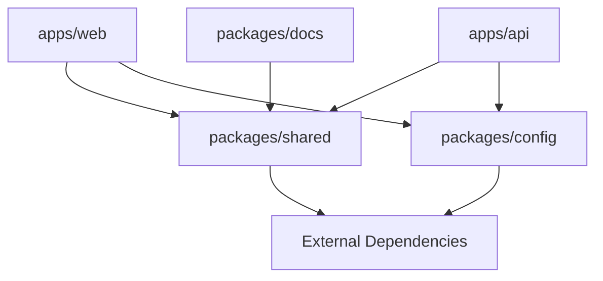

# Package Documentation

This directory contains documentation for each package in the ChatGPT Web monorepo.

## Package Overview

### Applications

- **[@chatgpt-web/web](./web.md)** - Vue.js frontend application
- **[@chatgpt-web/api](./api.md)** - Express.js backend service

### Shared Packages

- **[@chatgpt-web/shared](./shared.md)** - Common utilities and types
- **[@chatgpt-web/config](./config.md)** - Shared configuration files
- **[@chatgpt-web/docs](./docs.md)** - Documentation package

## Package Structure

```
apps/
├── web/                    # Frontend application
└── api/                    # Backend service

packages/
├── shared/                 # Shared utilities and types
├── docs/                   # Documentation
└── config/                 # Shared configuration
```

## Package Dependencies



## Development Workflow

### Building Packages

```bash
# Build all packages
pnpm build

# Build specific package
pnpm --filter @chatgpt-web/shared build

# Build with dependencies
pnpm --filter @chatgpt-web/web... build
```

### Testing Packages

```bash
# Test all packages
pnpm test

# Test specific package
pnpm --filter @chatgpt-web/api test

# Test with dependencies
pnpm --filter @chatgpt-web/web... test
```

### Package Scripts

Each package has its own scripts defined in `package.json`:

```bash
# Run package-specific script
pnpm --filter @chatgpt-web/web dev
pnpm --filter @chatgpt-web/api start
pnpm --filter @chatgpt-web/shared build
```

## Package Guidelines

### Naming Convention

- **Scope**: All packages use `@chatgpt-web/` scope
- **Format**: kebab-case (e.g., `@chatgpt-web/shared`)
- **Consistency**: Follow established naming patterns

### Dependencies

- **Shared Dependencies**: Common dependencies in root `package.json`
- **Package-Specific**: Only include dependencies directly used
- **Workspace Protocol**: Use `workspace:*` for internal dependencies

### Exports

Each package should have clear exports:

```json
{
  "main": "./dist/index.js",
  "types": "./dist/index.d.ts",
  "exports": {
    ".": {
      "import": "./dist/index.js",
      "types": "./dist/index.d.ts"
    }
  }
}
```

## Adding New Packages

### 1. Create Package Directory

```bash
mkdir packages/new-package
cd packages/new-package
```

### 2. Initialize Package

```bash
pnpm init
```

### 3. Configure Package.json

```json
{
  "name": "@chatgpt-web/new-package",
  "version": "1.0.0",
  "private": true,
  "main": "./dist/index.js",
  "types": "./dist/index.d.ts",
  "scripts": {
    "build": "tsup",
    "dev": "tsup --watch",
    "test": "vitest"
  }
}
```

### 4. Add to Workspace

The package will be automatically included in the workspace due to the `packages/*` pattern in `pnpm-workspace.yaml`.

### 5. Update Documentation

Add documentation for the new package in this directory.

## Package Maintenance

### Version Management

- **Synchronized Versions**: All packages share the same version
- **Release Process**: Use changesets for version management
- **Dependency Updates**: Keep dependencies up to date

### Quality Assurance

- **Type Checking**: All packages must pass TypeScript checks
- **Linting**: Follow ESLint configuration
- **Testing**: Maintain test coverage
- **Documentation**: Keep documentation current

For detailed information about each package, see the individual documentation files.
